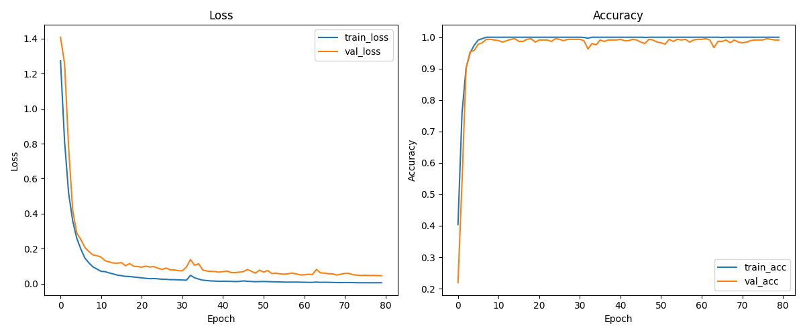
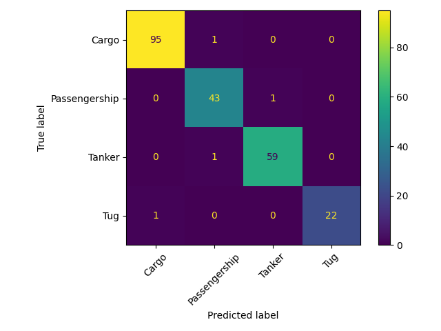

# 基于半监督变分自编码器的水下声学目标分类

本项目实现了基于深度学习的船舶声学分类，利用DeepShip部分数据集中的水下音频数据，通过半监督变分自编码器（SS-VAE）自动识别不同类型的船舶。

---

## 目录结构

```
VesselCategorization/
├── data/                # 数据集目录，每类船舶一个子文件夹，内含若干长wav音频
├── processed/           # 预处理后特征、标签和类别名保存目录
│   ├── X.npy
│   ├── y.npy
│   └── labels.npy
├── data_preprocess.py   # 数据预处理与特征提取脚本
├── train_and_eval.py    # 模型训练、验证与可视化脚本（PyTorch实现）
├── model.py             # 模型结构文件（PyTorch实现）
├── vessel_cnn.pt        # 训练好的模型权重
├── train_val_curve.png  # 损失与准确率曲线
├── confusion_matrix.png # 混淆矩阵可视化
└── README.md
```

---

## 数据处理流程

1. **数据组织**  
   - `data/`目录下，每个子文件夹为一种船舶类型，文件夹名即类别名，内部为若干超长`.wav`音频文件。

2. **音频切分与特征提取**  
   - 使用`librosa`读取每个音频文件，按5秒（可调）切分为多个小片段。
   - 对每个片段提取梅尔频谱（Mel-spectrogram, n_mels=64），并转为dB刻度。
   - 所有片段的梅尔频谱组成特征集，类别名转为数字标签。

3. **特征保存**  
   - 处理结果分别保存为`processed/X.npy`（特征）、`processed/y.npy`（标签）、`processed/labels.npy`（类别名）。

运行如下命令完成数据预处理：

```bash
python data_preprocess.py
```

---

## 模型结构与训练方法

### 模型架构综述

本项目采用**半监督变分自编码器（Semi-Supervised VAE，SS-VAE）架构**，这是一种专门为水下声学目标识别设计的概率生成模型。与传统的判别式分类器不同，该模型同时进行**无监督特征学习**和**有监督分类**，将生成式建模与判别式学习结合。

#### 设计理念

水下声学信号具有高度的**变异性**和**不确定性**：
- **环境因素**：海水温度、盐度、深度导致的声速变化
- **传播路径**：多径传播、反射、折射造成的信号失真
- **背景噪声**：海洋生物、船舶噪声、水流声等干扰
- **传感器特性**：不同水听器的频率响应差异

传统 CNN 分类器难以显式建模这些变异性，而半监督 VAE 通过**分离表示学习**将信号分解为两部分：
1. **隐变量 z（无监督）**：捕捉与类别无关的声学变异性（环境、噪声等）
2. **类别变量 c（有监督）**：捕捉船舶类别的判别特征

这种分离使模型能够：
- **解耦变异性和类别**：z 专注于"怎么变"，c 专注于"是什么"
- **提供不确定性度量**：通过概率分布输出预测置信度
- **生成式理解**：可从 z 重构输入，验证模型学到的特征表示

#### 架构流程图

```
输入梅尔频谱 (1, H, W)
         │
         ├─────────────────┬─────────────────┐
         ▼                 ▼                 ▼
  隐变量编码器        类别编码器         (原始数据)
  q(z|x)            q(c|x)
  [无监督路径]       [有监督路径]
         │                 │
         ▼                 ▼
    μ, log(σ²)      类别概率 p(c|x)
         │             (Softmax)
         │                 │
    重参数化采样            │
    z ~ q(z|x)            │
         │                 │
         ▼                 │
    生成解码器              │
    p(x|z)                │
         │                 │
         ▼                 ▼
    重构 x'           分类预测 ŷ
         │                 │
         └────────┬────────┘
                  ▼
              多任务损失
    L_recon + β·L_KL + γ·L_cls
```

#### 关键术语解释

**为什么叫"半监督 VAE"？**
- **无监督部分**：隐变量 z 的学习不依赖标签，通过重构损失和 KL 散度自动学习数据的内在结构
- **有监督部分**：类别预测 c 依赖标签，通过分类损失进行监督学习
- **联合训练**：两部分共同优化，互相增强

**与传统 VAE 的区别**：
- 传统 VAE：只有 z，完全无监督，无法直接分类
- 条件 VAE (CVAE)：z 依赖于标签 c，需要标签才能重构
- 半监督 VAE：z 和 c 独立编码，可同时处理有标签和无标签数据

#### 核心组件说明

**1. 隐变量编码器 q(z|x)**
- **概率解释**：学习后验分布 `q(z|x) = N(μ(x), σ²(x))`
- **作用**：捕捉与类别无关的声学变异性
- **输入**：梅尔频谱 `(batch, 1, H, W)`
- **输出**：分布参数 `μ, log(σ²) ∈ R^16`
- **架构**：4层卷积（特征提取）+ 2层全连接（分布参数化）

**2. 类别编码器 q(c|x)**
- **概率解释**：学习类别后验分布 `q(c|x) = Categorical(π(x))`
- **作用**：学习船舶类别的判别特征
- **输入**：梅尔频谱 `(batch, 1, H, W)`
- **输出**：类别概率 `π ∈ R^num_classes`
- **架构**：4层卷积 + 3层全连接 + Softmax

**3. 生成解码器 p(x|z)**
- **概率解释**：学习生成分布 `p(x|z) = N(μ_decoder(z), I)`
- **作用**：从隐变量 z 重构梅尔频谱
- **输入**：隐变量 `z ∈ R^16`
- **输出**：重构均值 `(batch, 1, H, W)`
- **架构**：2层全连接（维度扩展）+ 4层反卷积（空间重建）

**4. 重参数化技巧**
```
z = μ + σ · ε,  其中 ε ~ N(0, I)
```
- **作用**：使随机采样可微分，允许反向传播
- **直观理解**：在均值附近按标准差大小随机扰动

### 模型结构

本项目采用**变分自编码器（VAE）架构**的声学目标识别模型 `AcousticVAE`，专门针对水下声学特征的变异性设计。

#### 核心思想

模型同时学习两个关键要素：
1. **隐变量 z**：捕捉声学特征的潜在表示和变异性（如：噪声、传播路径、海洋环境等因素）
2. **类别概率 c**：学习目标船舶的类别分布

#### 网络架构

**输入**：单通道梅尔频谱图，形状为 `(1, H, W)`

**编码器1 (encoder_z)**：学习声学变异性的隐变量
- 4层卷积网络（1→32→64→128→256通道）
- 每层使用 stride=2 下采样，BatchNorm 和 LeakyReLU
- 全连接层输出隐变量的均值 μ 和对数方差 log(σ²)
- 隐变量维度：16（可配置）
- **特征图尺寸变化**：`(H, W) → (H/2, W/2) → (H/4, W/4) → (H/8, W/8) → (H/16, W/16)`

**编码器2 (encoder_c)**：学习目标类别概率
- 4层卷积网络（架构与 encoder_z 相同）
- 3层全连接网络（feature_dim → 512 → 256 → num_classes）
- Softmax 输出类别概率分布
- **网络深度**：更深的全连接层确保充分的判别能力

**解码器 (decoder)**：从隐变量重构梅尔频谱
- 全连接层扩展维度（z_dim → 512 → feature_dim）
- 4层反卷积网络（256→128→64→32→1通道）
- 每层使用 stride=2 上采样，BatchNorm 和 LeakyReLU
- 最后使用 Sigmoid 归一化到 [0,1]
- **自适应插值**：使用双线性插值确保输出尺寸与输入完全匹配

**输出**：
- 重构的梅尔频谱 `x_recon`
- 隐变量的分布参数 `μ, log(σ²)`
- 类别概率分布 `c`

#### 参数量统计

假设输入尺寸为 `(1, 128, 128)`，类别数为 5：
- **Encoder_z**: ~1.2M 参数
- **Encoder_c**: ~1.5M 参数（包含分类头）
- **Decoder**: ~1.0M 参数
- **总参数量**: ~3.7M 参数

#### 重参数化技巧

使用重参数化技巧使 VAE 可微分：`z = μ + σ * ε`，其中 `ε ~ N(0, I)`

### 训练方法

#### 损失函数

总损失由三部分组成：

```
总损失 = 重构损失 + λ_kl × KL散度损失 + λ_class × 分类损失
```

1. **重构损失**（MSE）：衡量重构梅尔频谱与原始输入的差异
2. **KL散度损失**：正则化隐变量分布，防止后验崩塌
   - `KL(q(z|x) || p(z)) = -0.5 × Σ(1 + log(σ²) - μ² - σ²)`
   - 使用 KL 平衡技巧，最小值限制为 0.1
3. **分类损失**（交叉熵）：监督类别预测的准确性

#### 超参数配置

- **学习率**：5e-4
- **优化器**：Adam
- **批大小**：64
- **训练轮数**：80
- **训练/验证划分**：80% / 20%（随机种子：2）
- **损失权重**：
  - λ_kl = 1.0（KL散度）
  - λ_class = 10.0（分类损失）
- **隐变量维度**：16
- **设备**：自动检测 GPU 或 CPU

#### 模型优势

1. **处理声学变异性**：通过隐变量 z 显式建模声学特征的不确定性和变异性
2. **概率解释**：输出类别概率分布，提供预测置信度
3. **生成能力**：可从隐变量重构梅尔频谱，有助于理解学到的特征
4. **正则化**：KL散度损失防止过拟合，提高泛化能力

---

## 结果可视化与模型表现

### 损失与准确率曲线

训练过程中的损失和准确率如下图所示：



- **分析**：随着训练轮数的增加，训练损失逐渐下降，准确率逐步提升，验证集表现稳定，说明模型收敛良好且无明显过拟合。模型最高验证精度为**0.9865**。

### 混淆矩阵

模型在验证集上的分类表现如下：



- **分析**：混淆矩阵展示了各类别的分类准确性，对角线上的数值越高，说明模型对该类别的识别效果越好。由图可见模型对各类别的识别精度均较高。

---

## 依赖环境

- librosa
- numpy
- torch
- matplotlib
- scikit-learn

安装依赖：

```bash
pip install -r requirements.txt
```

---

## 参考

- [librosa: Python音频分析库](https://librosa.org/)
- [PyTorch: 深度学习框架](https://pytorch.org/)
