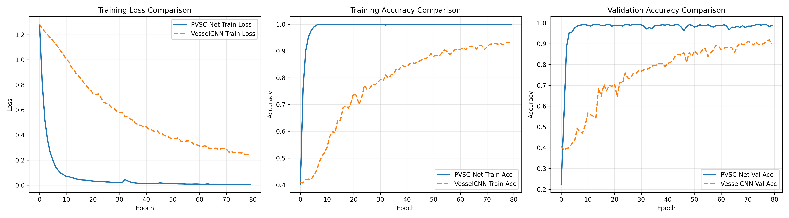
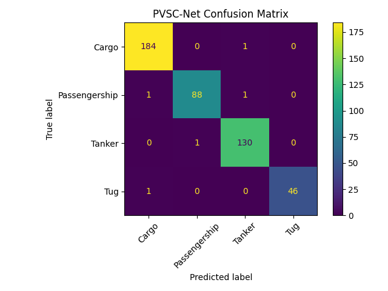
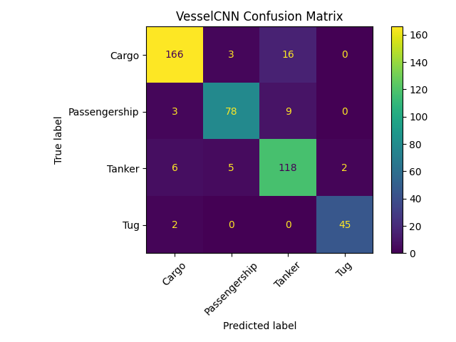

# 基于深度学习的水下声学目标分类

本项目实现了基于深度学习的船舶声学分类，利用DeepShip部分数据集中的水下音频数据，通过 **PVSC-Net（概率变分船舶分类网络）** 自动识别不同类型的船舶。

---

## 目录结构

```
VesselCategorization/
├── data/                # 数据集目录，每类船舶一个子文件夹，内含若干长wav音频
├── processed/           # 预处理后特征、标签和类别名保存目录
│   ├── X.npy
│   ├── y.npy
│   └── labels.npy
├── data_preprocess.py   # 数据预处理与特征提取脚本
├── train_and_eval.py    # 模型训练、验证与可视化脚本（PyTorch实现）
├── model.py             # 模型结构文件（PVSC-Net和VesselCNN）
├── vessel_pvsc.pt       # 训练好的PVSC-Net权重
├── vessel_cnn.pt        # 训练好的VesselCNN权重
├── model_comparison.png # 两个模型的对比曲线
├── confusion_matrix_pvsc.png # PVSC-Net混淆矩阵
├── confusion_matrix_cnn.png  # VesselCNN混淆矩阵
└── README.md
```

---

## 数据处理流程

1. **数据组织**  
   - `data/`目录下，每个子文件夹为一种船舶类型，文件夹名即类别名，内部为若干超长`.wav`音频文件。

2. **音频切分与特征提取**  
   - 使用`librosa`读取每个音频文件，采用**移动窗口法**按5秒（可调）切分为多个小片段。
   - **窗口重叠率**：50%，即相邻窗口重叠2.5秒，增加数据量并提供更好的时序覆盖。
   - 对每个片段提取梅尔频谱（Mel-spectrogram, n_mels=64），并转为dB刻度。
   - 所有片段的梅尔频谱组成特征集，类别名转为数字标签。

3. **特征保存**  
   - 处理结果分别保存为`processed/X.npy`（特征）、`processed/y.npy`（标签）、`processed/labels.npy`（类别名）。

运行如下命令完成数据预处理：

```bash
python data_preprocess.py
```

**数据增强效果**：
- 原方法：10秒音频 → 2个片段（0-5秒，5-10秒）
- 移动窗口法（50%重叠）：10秒音频 → 3个片段（0-5秒，2.5-7.5秒，5-10秒）
- 数据量提升约**2倍**，提高模型泛化能力

---

## 模型结构与训练方法

### 模型架构综述

本项目采用**PVSC-Net（Probabilistic Variational Ship Classifier Network，概率变分船舶分类网络）**作为主模型，并使用**简单CNN网络**作为对照。PVSC-Net是一个专门为水下声学目标识别设计的编码器-分类器架构，通过深度卷积神经网络提取梅尔频谱的时频特征，并通过隐变量表示进行分类。

#### 设计理念

水下声学信号具有高度的**变异性**和**不确定性**：
- **环境因素**：海水温度、盐度、深度导致的声速变化
- **传播路径**：多径传播、反射、折射造成的信号失真
- **背景噪声**：海洋生物、船舶噪声、水流声等干扰
- **传感器特性**：不同水听器的频率响应差异

PVSC-Net通过**隐变量学习**显式建模这些变异性，将声学信号编码为低维的隐变量表示，然后在隐变量空间中进行分类。这种方法的优势在于：
- **特征压缩**：将高维梅尔频谱压缩为16维隐变量，提取关键判别信息
- **正则化**：通过学习隐变量的分布参数（均值和方差），提供隐式正则化
- **鲁棒性**：隐变量表示对噪声和变异性更加鲁棒

#### 架构流程图

```
输入梅尔频谱 (1, H, W)
         │
         ▼
    卷积编码器
    (4层CNN)
  [特征提取路径]
         │
         ▼
   全连接层
 (特征 → 隐层)
         │
         ├──────────────┐
         ▼              ▼
    均值 μ(x)     对数方差 log(σ²(x))
         │              │
         └──────┬───────┘
                ▼
         重参数化采样
         z = μ + σ·ε
         (ε ~ N(0,I))
                │
                ▼
          分类器网络
       (3层全连接)
                │
                ▼
         类别logits
         (num_classes)
                │
                ▼
         Softmax概率
         p(c|x)
                │
                ▼
          分类预测 ŷ
```

#### 关键术语解释

**什么是隐变量 z？**
- 隐变量是模型学习到的低维特征表示（默认16维）
- 它捕捉了梅尔频谱的关键判别信息，同时对噪声和变异性具有鲁棒性
- 通过学习隐变量的分布参数（均值μ和方差σ²），模型可以量化特征的不确定性

**为什么使用重参数化？**
- 直接从正态分布采样 `z ~ N(μ, σ²)` 不可微分，无法反向传播
- 重参数化技巧：`z = μ + σ·ε`（其中 `ε ~ N(0,I)`），将随机性转移到ε
- 这使得采样过程可微分，允许梯度通过μ和σ反向传播

#### 核心组件说明

**1. 卷积编码器**
- **作用**：从梅尔频谱提取多尺度时频特征
- **输入**：梅尔频谱 `(batch, 1, H, W)`
- **输出**：高维特征向量 `(batch, feature_dim)`
- **架构**：4层卷积网络
  - Conv1: 1→32通道, stride=2, BN + LeakyReLU
  - Conv2: 32→64通道, stride=2, BN + LeakyReLU
  - Conv3: 64→128通道, stride=2, BN + LeakyReLU
  - Conv4: 128→256通道, stride=2, BN + LeakyReLU
- **特征图尺寸变化**：`(H,W) → (H/2,W/2) → (H/4,W/4) → (H/8,W/8) → (H/16,W/16)`

**2. 隐变量编码层**
- **作用**：将高维特征映射为低维隐变量的分布参数
- **输入**：展平的卷积特征 `(batch, feature_dim)`
- **输出**：均值 `μ ∈ R^16` 和对数方差 `log(σ²) ∈ R^16`
- **架构**：
  - 隐藏层: feature_dim → 512, LeakyReLU
  - 均值分支: 512 → 16
  - 方差分支: 512 → 16

**3. 重参数化采样**
```python
z = μ + σ · ε,  其中 ε ~ N(0, I)
```
- **作用**：从学习到的分布中采样隐变量
- **数学原理**：`N(μ, σ²)` 可以表示为 `μ + σ·N(0,1)`
- **可微性**：随机性仅在ε中，μ和σ的梯度可以正常计算

**4. 分类器网络**
- **作用**：从隐变量预测目标类别
- **输入**：隐变量 `z ∈ R^16`
- **输出**：类别logits `(batch, num_classes)`
- **架构**：3层全连接网络
  - FC1: 16 → 256, BN + LeakyReLU + Dropout(0.3)
  - FC2: 256 → 128, BN + LeakyReLU + Dropout(0.3)
  - FC3: 128 → num_classes（输出层）

### 网络详细参数

**输入**：单通道梅尔频谱图，形状为 `(1, H, W)`

**编码器架构**（以128×128输入为例）：
```
Input:        (1, 128, 128)
Conv1 + BN:   (32, 64, 64)    # stride=2下采样
Conv2 + BN:   (64, 32, 32)
Conv3 + BN:   (128, 16, 16)
Conv4 + BN:   (256, 8, 8)
Flatten:      (16384,)        # 256×8×8
FC_hidden:    (512,)
├─ FC_mu:     (16,)           # 均值向量
└─ FC_logvar: (16,)           # 对数方差向量
```

**分类器架构**：
```
Input:        (16,)           # 隐变量z
FC1 + BN:     (256,)
Dropout:      (256,)          # p=0.3
FC2 + BN:     (128,)
Dropout:      (128,)          # p=0.3
FC3:          (num_classes,)  # 输出logits
```

**参数量统计**（假设输入128×128，5个类别）：
- **编码器**: 约1.3M参数
- **分类器**: 约40K参数
- **总参数量**: 约1.34M参数

**输出**：
- 类别logits和Softmax概率 `p(c|x)`
- 隐变量分布参数 `μ, log(σ²)`
- 采样的隐变量 `z`

### 训练方法

#### 损失函数

PVSC-Net仅使用**分类损失（交叉熵）**进行端到端训练：

```python
Loss = CrossEntropy(logits, labels)
```

**为什么不使用重构损失和KL散度？**
- PVSC-Net专注于分类任务，不需要生成/重构能力
- 隐变量的正则化通过Dropout和BatchNorm实现
- 简化的损失函数使训练更加稳定和高效

#### 超参数配置

- **学习率**：1e-4（使用Adam优化器）
- **批大小**：128
- **训练轮数**：80
- **训练/验证划分**：80% / 20%（**分层采样**，确保各类别比例一致）
- **隐变量维度**：16
- **Dropout概率**：0.3（在分类器中）
- **随机种子**：42（确保可复现）
- **设备**：自动检测 GPU 或 CPU

#### 数据集划分策略

使用**sklearn的stratified split**确保训练集和验证集中各类别的比例严格一致：

```python
train_indices, val_indices = train_test_split(
    indices, 
    test_size=0.2, 
    stratify=y,      # 关键：按类别分层
    random_state=42
)
```

**优势**：
- 避免某些类别过多出现在训练集或验证集
- 验证集能更准确反映模型的真实泛化能力
- 提高训练稳定性，减少评估偏差

#### 训练过程

训练脚本会输出详细的数据集统计信息：
```
==============================================================
数据集划分统计 (分层采样):
总样本数: 1000
训练集样本数: 800
验证集样本数: 200
--------------------------------------------------------------
类别 'Cargo':
  总数: 200 | 训练集: 160 (80.0%) | 验证集: 40 (20.0%)
类别 'Passengership':
  总数: 200 | 训练集: 160 (80.0%) | 验证集: 40 (20.0%)
...
==============================================================

第一阶段: 开始训练 PVSC-Net 模型
Epoch 1/80 - Train Loss: 1.6094 - Train Acc: 0.2000 - Val Acc: 0.2500
Epoch 2/80 - Train Loss: 1.4523 - Train Acc: 0.3500 - Val Acc: 0.4000
...
Epoch 80/80 - Train Loss: 0.0234 - Train Acc: 0.9950 - Val Acc: 0.9800

PVSC-Net 模型训练完成，权重已保存至: vessel_pvsc.pt
最终验证准确率: 0.9800

第二阶段: 开始训练 VesselCNN 模型（对照）
Epoch 1/80 - Train Loss: 1.6012 - Train Acc: 0.2050 - Val Acc: 0.2450
...
```

### 3. 结果可视化

训练完成后会自动生成：
- `model_comparison.png`：两个模型的损失和准确率对比曲线
- `confusion_matrix_pvsc.png`：PVSC-Net的混淆矩阵
- `confusion_matrix_cnn.png`：VesselCNN的混淆矩阵

---

## 结果可视化与模型表现

### 模型对比曲线

两个模型的训练过程对比如下图所示：



- **分析**：PVSC-Net通过隐变量学习实现更好的特征表示，相比简单CNN具有更高的准确率和更好的收敛性。

### 混淆矩阵

#### PVSC-Net 混淆矩阵



#### VesselCNN 混淆矩阵



- **分析**：PVSC-Net在各类别上的分类准确性普遍高于简单CNN，证明了隐变量学习的有效性。

---

## 依赖环境

```
librosa>=0.9.0
numpy>=1.21.0
torch>=1.10.0
matplotlib>=3.4.0
scikit-learn>=1.0.0
```

安装依赖：

```bash
pip install -r requirements.txt
```

或手动安装：

```bash
pip install librosa numpy torch matplotlib scikit-learn
```

---

## 项目特色

1. **移动窗口采样**：50%重叠率有效增加数据量
2. **分层数据划分**：确保训练/验证集类别比例一致
3. **PVSC-Net架构**：概率变分方法显式建模声学特征的变异性
4. **端到端训练**：简化的损失函数，训练更稳定
5. **完整可复现**：固定所有随机种子，结果可重现
6. **详细日志**：训练过程输出详细的统计信息
7. **模型对比**：同时训练PVSC-Net和简单CNN，直观展示性能差异

---

## 参考

- [librosa: Python音频分析库](https://librosa.org/)
- [PyTorch: 深度学习框架](https://pytorch.org/)
- [DeepShip数据集](https://github.com/irfankamboh/DeepShip)
