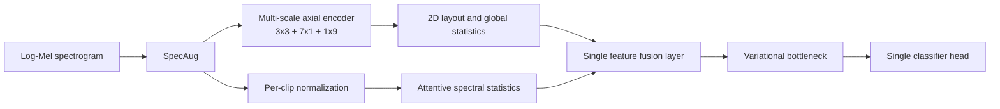
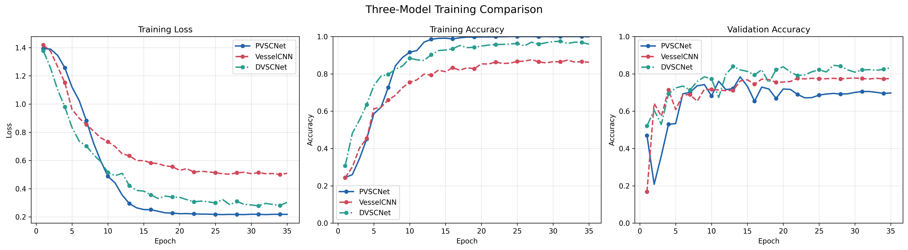
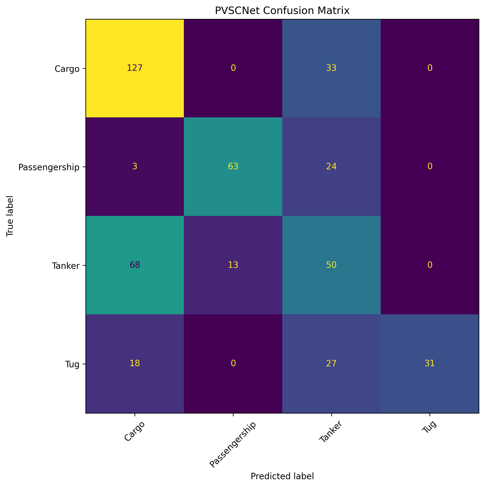
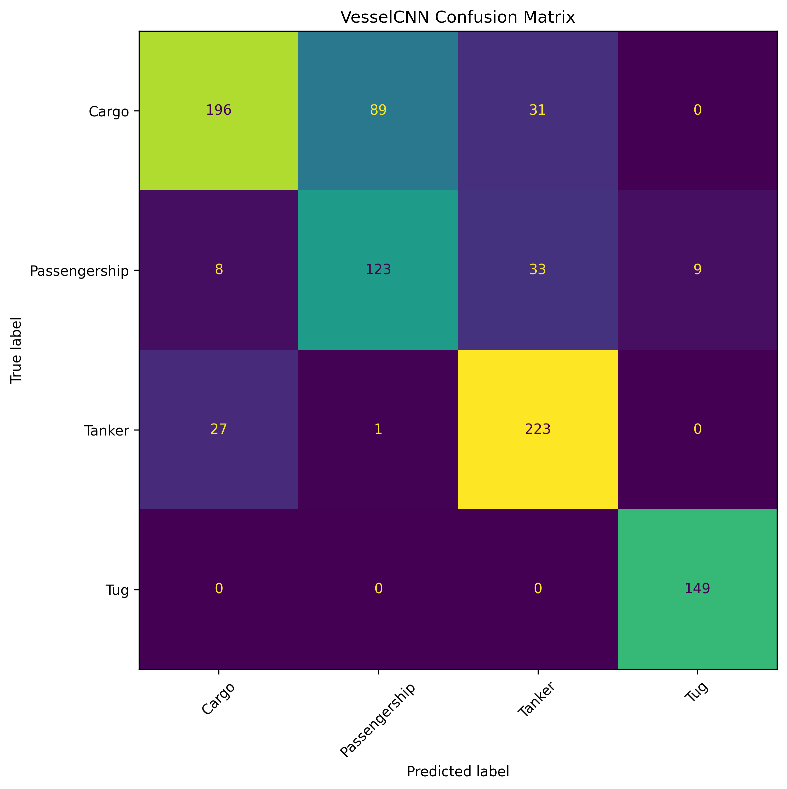
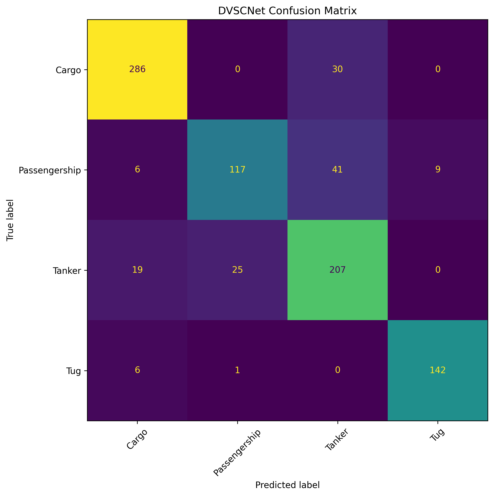

# 基于深度学习的水下声学目标分类

本项目实现了基于深度学习的船舶声学分类，包含 **PVSCNet**、**VesselCNN** 和 **DVSCNet** 三种模型，可分别训练并基于统一日志进行对比。

---

## 目录结构

```
Semi-Supervised-VAE-Acoustic-Classification/
├── data/                         # 原始数据
├── processed/                    # 特征、标签、原始 WAV 分组、窗口起点和预处理配置
├── PVSCNet/
│   ├── model_PVSCNet.py
│   ├── train_PVSCNet.py
│   ├── checkpoint_best_PVSCNet.pt
│   ├── checkpoint_latest_PVSCNet.pt
│   ├── log_best_PVSCNet.json
│   ├── log_latest_PVSCNet.json
│   ├── curve_training_PVSCNet.png
│   └── matrix_confusion_PVSCNet.png
├── VesselCNN/                    # 同样的模型、训练及产物结构
├── DVSCNet/                      # 同样的模型、训练及产物结构
├── training_utils.py             # 三个训练入口共享的数据、训练和记录逻辑
├── plot_compare_models.py        # 从三个最新日志绘制对比曲线
├── curve_comparison_three_models.png
├── data_preprocess.py
└── README.md
```

每个模型目录都采用 `英文标识_模型名` 的命名方式。`latest` 文件记录最近一次训练，`best` 文件仅在相同数据划分、采样和归一化协议下，本次最佳验证准确率超过历史最佳时更新。

---

## 数据处理流程

1. **数据组织**  
   - `data/`目录下，每个子文件夹为一种船舶类型，文件夹名即类别名，内部为若干超长`.wav`音频文件。

2. **音频切分与特征提取**  
   - 使用`librosa`读取每个音频文件，采用**移动窗口法**按5秒（可调）切分为多个小片段。
  - **窗口重叠率**：75%，步长为1.25秒；内部窗口在步长的20%范围内做带种子的随机抖动（默认±0.25秒）。
  - 首尾窗口固定覆盖录音边界，中间窗口起点随`--seed`变化；同一随机种子可以完全复现。
  - 对每个片段提取梅尔频谱（Mel-spectrogram, n_mels=64），并转为dB刻度，形成`64×157`二维主特征。
  - 同时提取33维辅助描述符：14维GLCM纹理、7维Hu矩、4维频谱图梯度、4维包络谱和4维基础声学统计。
  - 数据预处理只保存原始辅助描述符；完成文件级训练/验证划分后，使用训练采样拟合`StandardScaler → PCA(12) → LDA(3) → StandardScaler`，验证文件不参与特征选择器拟合。
  - 三个模型分别编码二维log-Mel和3维选择特征，并在各自唯一分类头之前进行特征级融合。

3. **特征保存**  
  - `X.npy`与`y.npy`：梅尔频谱和类别标签。
  - `auxiliary_features.npy`：与每个梅尔窗口逐条对齐的33维原始辅助描述符。
  - `groups.npy`：每个窗口对应的原始 WAV，用于文件级互斥划分。
  - `window_starts.npy`：窗口在原始 WAV 中的起始采样点，用于审计重复和越界。
  - `preprocess_config.json`：重叠率、抖动、随机种子、辅助特征名称和数据指纹的来源配置。

运行如下命令完成数据预处理：

```bash
python data_preprocess.py --overlap-ratio 0.75 --jitter-ratio 0.2 --seed 2026
```

**数据增强效果**：
- 原方法：10秒音频 → 2个片段（0-5秒，5-10秒）
- 75%重叠法：10秒音频约生成5个片段，并在不越界的前提下随机扰动内部窗口起点
- 当前数据由2,264个窗口增加到**4,416个窗口**，增长约95.1%
- 增加的是同一录音内的时间覆盖，不等同于新增独立录音；泛化评估仍以63个原始 WAV 为分组单位

---

## 模型结构与训练方法

### 模型架构综述

本项目采用 **PVSCNet** 和单模型 **DVSCNet** 进行变分声学分类，并使用 **VesselCNN** 作为卷积基线。重构后的 DVSCNet 面向未见录音文件的域泛化，只有一个模型实例、一个变分瓶颈和一个分类输出头，不依赖旧模型集成或 logits 融合。

DVSCNet 在同一网络内联合建模时频纹理与频谱上下文：

- **多尺度轴向编码器**：在同一特征流中组合 $3\times3$、$7\times1$ 和 $1\times9$ 深度卷积，分别捕捉局部纹理、窄带谐波和长时间调制，并用频率/时间轴注意力重标定特征。
- **二维布局与全局统计**：从同一编码特征图提取 $4\times5$ 平均/最大池化布局，以及均值、标准差和最大值，避免只靠全局池化丢失 Cargo 与 Tanker 的时频位置差异。
- **归一化频谱上下文**：对逐片段标准化后的频率均值、标准差和峰值进行注意力统计编码，并在唯一的融合层中与二维特征联合建模；该模块不产生独立预测，因此不是第二个模型。
- **域泛化与变分正则**：GroupNorm、MixStyle、逐样本 SpecAug、标签平滑、受控潜变量噪声和 KL 信息瓶颈共同抑制源文件记忆；评估时使用 $\mu$ 保证预测确定性。


```mermaid
flowchart LR
  accTitle: Single-Model DVSCNet Architecture
  accDescr: One DVSCNet extracts axial time-frequency features and normalized spectral statistics, fuses them before one variational bottleneck, and produces one classification output.

  input["Log-Mel spectrogram"] --> augment["SpecAug"]
  augment --> encoder["Multi-scale axial encoder<br/>3x3 + 7x1 + 1x9"]
  encoder --> layout["2D layout and global statistics"]
  augment --> normalize["Per-clip normalization"]
  normalize --> context["Attentive spectral statistics"]
  layout --> fusion["Single feature fusion layer"]
  context --> fusion
  fusion --> latent["Variational bottleneck"]
  latent --> classifier["Single classifier head"]
```

#### 设计理念

水下声学信号具有高度的**变异性**和**不确定性**：
- **环境因素**：海水温度、盐度、深度导致的声速变化
- **传播路径**：多径传播、反射、折射造成的信号失真
- **背景噪声**：海洋生物、船舶噪声、水流声等干扰
- **传感器特性**：不同水听器的频率响应差异

PVSC-Net通过**隐变量学习**显式建模这些变异性，将声学信号编码为低维的隐变量表示，然后在隐变量空间中进行分类。这种方法的优势在于：
- **特征压缩**：将高维梅尔频谱压缩为16维隐变量，提取关键判别信息
- **正则化**：通过学习隐变量的分布参数（均值和方差），提供隐式正则化
- **鲁棒性**：隐变量表示对噪声和变异性更加鲁棒

#### 架构流程图

```
输入梅尔频谱 (1, H, W)
         │
         ▼
    卷积编码器
    (4层CNN)
  [特征提取路径]
         │
         ▼
   全连接层
 (特征 → 隐层)
         │
         ├──────────────┐
         ▼              ▼
    均值 μ(x)     对数方差 log(σ²(x))
         │              │
         └──────┬───────┘
                ▼
         重参数化采样
         z = μ + σ·ε
         (ε ~ N(0,I))
                │
                ▼
          分类器网络
       (3层全连接)
                │
                ▼
         类别logits
         (num_classes)
                │
                ▼
         Softmax概率
         p(c|x)
                │
                ▼
          分类预测 ŷ
```

#### 关键术语解释

**什么是隐变量 z？**
- 隐变量是模型学习到的低维特征表示（默认16维）
- 它捕捉了梅尔频谱的关键判别信息，同时对噪声和变异性具有鲁棒性
- 通过学习隐变量的分布参数（均值μ和方差σ²），模型可以量化特征的不确定性

**为什么使用重参数化？**
- 直接从正态分布采样 `z ~ N(μ, σ²)` 不可微分，无法反向传播
- 重参数化技巧：`z = μ + σ·ε`（其中 `ε ~ N(0,I)`），将随机性转移到ε
- 这使得采样过程可微分，允许梯度通过μ和σ反向传播

#### 核心组件说明

**1. 卷积编码器**
- **作用**：从梅尔频谱提取多尺度时频特征
- **输入**：梅尔频谱 `(batch, 1, H, W)`
- **输出**：高维特征向量 `(batch, feature_dim)`
- **架构**：4层卷积网络
  - Conv1: 1→32通道, stride=2, BN + LeakyReLU
  - Conv2: 32→64通道, stride=2, BN + LeakyReLU
  - Conv3: 64→128通道, stride=2, BN + LeakyReLU
  - Conv4: 128→256通道, stride=2, BN + LeakyReLU
- **特征图尺寸变化**：`(H,W) → (H/2,W/2) → (H/4,W/4) → (H/8,W/8) → (H/16,W/16)`

**2. 隐变量编码层**
- **作用**：将高维特征映射为低维隐变量的分布参数
- **输入**：展平的卷积特征 `(batch, feature_dim)`
- **输出**：均值 `μ ∈ R^16` 和对数方差 `log(σ²) ∈ R^16`
- **架构**：
  - 隐藏层: feature_dim → 512, LeakyReLU
  - 均值分支: 512 → 16
  - 方差分支: 512 → 16

**3. 重参数化采样**
```python
z = μ + σ · ε,  其中 ε ~ N(0, I)
```
- **作用**：从学习到的分布中采样隐变量
- **数学原理**：`N(μ, σ²)` 可以表示为 `μ + σ·N(0,1)`
- **可微性**：随机性仅在ε中，μ和σ的梯度可以正常计算

**4. 分类器网络**
- **作用**：从隐变量预测目标类别
- **输入**：隐变量 `z ∈ R^16`
- **输出**：类别logits `(batch, num_classes)`
- **架构**：3层全连接网络
  - FC1: 16 → 256, BN + LeakyReLU + Dropout(0.3)
  - FC2: 256 → 128, BN + LeakyReLU + Dropout(0.3)
  - FC3: 128 → num_classes（输出层）

### 网络详细参数

**输入**：单通道梅尔频谱图，形状为 `(1, H, W)`

**编码器架构**（以128×128输入为例）：
```
Input:        (1, 128, 128)
Conv1 + BN:   (32, 64, 64)    # stride=2下采样
Conv2 + BN:   (64, 32, 32)
Conv3 + BN:   (128, 16, 16)
Conv4 + BN:   (256, 8, 8)
Flatten:      (16384,)        # 256×8×8
FC_hidden:    (512,)
├─ FC_mu:     (16,)           # 均值向量
└─ FC_logvar: (16,)           # 对数方差向量
```

**分类器架构**：
```
Input:        (16,)           # 隐变量z
FC1 + BN:     (256,)
Dropout:      (256,)          # p=0.3
FC2 + BN:     (128,)
Dropout:      (128,)          # p=0.3
FC3:          (num_classes,)  # 输出logits
```

**参数量统计**（假设输入128×128，5个类别）：
- **编码器**: 约1.3M参数
- **分类器**: 约40K参数
- **总参数量**: 约1.34M参数

**输出**：
- 类别logits和Softmax概率 `p(c|x)`
- 隐变量分布参数 `μ, log(σ²)`
- 采样的隐变量 `z`

### 训练方法

#### 损失函数

PVSC-Net 和 VesselCNN 使用带标签平滑的交叉熵。DVSCNet 在分类损失之外加入小权重 KL 信息瓶颈：

$$
\mathcal{L}_{\mathrm{DVSC}} = \mathcal{L}_{\mathrm{CE}} + \beta D_{\mathrm{KL}}\left(q_\phi(z\mid x)\,\|\,\mathcal{N}(0,I)\right),\qquad \beta=5\times10^{-4}.
$$

DVSCNet 不引入解码器和重构损失，KL 项只约束判别隐空间，避免方差分支在仅有交叉熵时退化为无约束噪声源。

#### 超参数配置

- **学习率**：默认1e-4；当前最佳 DVSCNet 运行使用3e-4（AdamW和验证损失自适应退火）
- **批大小**：默认256
- **训练轮数**：默认100，验证损失连续停滞时提前停止
- **训练/验证划分**：80% / 20%（**按源WAV分组的分层划分**）
- **隐变量维度**：PVSCNet默认16，DVSCNet默认32
- **Dropout概率**：0.4
- **DVSCNet KL权重**：5e-4
- **DVSCNet权重衰减**：1e-3
- **随机种子**：42（确保可复现）
- **设备**：自动检测 GPU 或 CPU

#### 数据集划分策略

共享训练工具采用**类别分层的原始文件级划分**。同一个 WAV 生成的全部75%重叠窗口只能出现在训练集或验证集一侧：

```python
train_indices, val_indices = stratified_group_split(
  targets=y,
  groups=source_wav,
  val_split=0.2,
  seed=42,
)
```

**优势**：
- 消除相邻重叠窗口跨集合造成的数据泄漏
- 直接评估模型对未见原始录音的泛化能力
- 训练集 MinMax 统计量不读取验证文件
- 训练采样同时均衡类别和原始 WAV；每轮每个源 WAV 默认最多抽取128个不重复窗口，避免长录音和相邻重叠窗口支配梯度
- 验证损失停滞时自动降低学习率，并使用梯度裁剪稳定更新
- 使用验证损失早停，最终评估加载本次运行中最佳验证准确率对应的权重

#### 训练过程

在项目根目录分别运行：

```bash
python PVSCNet/train_PVSCNet.py
python VesselCNN/train_VesselCNN.py
python DVSCNet/train_DVSCNet.py
```

所有入口都支持 `--epochs`、`--batch-size`、`--learning-rate`、`--val-split`、`--seed`、`--num-workers`、`--windows-per-source`、`--early-stopping-patience` 和 `--gradient-clip-norm`。例如：

```bash
python DVSCNet/train_DVSCNet.py --epochs 30 --batch-size 64 --learning-rate 3e-4 --seed 2026
```

DVSCNet 还支持 `--z-dim`、`--dropout`、`--kl-weight`、`--weight-decay`、`--latent-noise-scale` 和 `--disable-spec-augment`。

每次训练结束后，模型目录会保存：

- `checkpoint_latest_模型名.pt`：最近一次训练结束时的权重
- `checkpoint_best_模型名.pt`：所有历史训练中的最佳权重
- `log_latest_模型名.json`：最近一次训练的配置、完整曲线和结果摘要
- `log_best_模型名.json`：历史最佳训练记录
- `curve_training_模型名.png`：本次训练损失和准确率曲线
- `matrix_confusion_模型名.png`：本次最佳 epoch 权重的混淆矩阵
- `selector_latest_模型名.joblib`：最近一次训练使用的辅助特征标准化、PCA和LDA参数
- `selector_best_模型名.joblib`：与历史最佳checkpoint配套的辅助特征选择器

三个模型训练完成后，在项目根目录运行：

```bash
python plot_compare_models.py
```

脚本读取三个 `log_latest_模型名.json`，生成根目录下的 `curve_comparison_three_models.png`。

评估三种方法在不同数据噪声强度下的分类精度：

```bash
python evaluate_noise_robustness.py
```

该实验在归一化到 `[0, 1]` 的验证集梅尔特征上加入零均值高斯噪声，默认标准差为 `0、0.05、0.10、0.15、0.20`。每个非零强度使用相同噪声样本评估三个模型并重复5次，结果均值与标准差写入 `noise_robustness_results.json`，同时生成无标题的单图分组柱状图 `noise_robustness_three_models.png`。

---

## 结果可视化与模型表现

### 文件级无泄漏对比

最终对比使用相同的75%重叠预处理、文件级分层随机划分、类别与源文件均衡采样、仅训练集拟合的 MinMax 归一化和辅助特征`StandardScaler → PCA(12) → LDA(3) → StandardScaler`，随机种子为2026。训练集和测试集包含51/12个互斥原始 WAV，对应3,527/889个窗口，源文件交集为0。数据协议指纹为`80093138f16f9a9f`。

| 模型 | 参数量 | 最佳轮次 | 验证准确率 | 宏平均 F1 |
| --- | ---: | ---: | ---: | ---: |
| PVSCNet | 540,554 | 10 | **87.06%** | **87.86%** |
| VesselCNN | 623,178 | 24 | 82.34% | 82.84% |
| DVSCNet | 707,083 | 30 | 86.05% | 86.50% |

这组结果来自同一文件级划分、无放回源文件均衡采样和训练集专属辅助特征选择，不能与旧版纯log-Mel、窗口随机划分或有放回重复采样的结果直接比较。增强特征显著提高了PVSCNet的最佳验证表现；本次单次划分中PVSCNet领先DVSCNet约1.01个百分点，因此当前不能再表述为DVSCNet最优。PVSCNet与DVSCNet在评估模式下都使用潜变量均值，保证同一checkpoint的结果可重复。当前Tug类仅有3个源录音，本次划分为2个训练、1个验证，单次验证指标仍具有较高方差；后续应增加真实录音并采用重复GroupKFold评估置信区间。独立复评结果保存在`evaluation_summary_enhanced_features.json`。

### 模型对比曲线

三个模型最近一次训练过程的对比如下图所示：



- **分析**：曲线应结合日志中的 `split_strategy`、`train_sampling` 和 `feature_normalization` 解读，只有协议一致的运行可以直接比较。

### 混淆矩阵

#### PVSC-Net 混淆矩阵



#### VesselCNN 混淆矩阵



#### DVSCNet 混淆矩阵



- **分析**：增强特征协议下，PVSCNet的Cargo、Passengership、Tanker和Tug召回率分别为87.66%、69.94%、90.44%和100%；DVSCNet分别为86.08%、71.10%、88.05%和100%。三个模型的主要剩余难点仍是Passengership。

---

## 依赖环境

```
librosa>=0.9.0
numpy>=1.21.0
torch>=1.10.0
matplotlib>=3.4.0
scikit-learn>=1.0.0
scipy>=1.7.0
joblib>=1.1.0
```

安装依赖：

```bash
pip install -r requirements.txt
```

或手动安装：

```bash
pip install librosa numpy torch matplotlib scikit-learn
```

---

## 项目特色

1. **移动窗口采样**：75%重叠率提高单个录音内部的时间覆盖
2. **分层数据划分**：确保训练/验证集类别比例一致
3. **单模型DVSC-Net**：轴向时频卷积、注意力统计与唯一变分分类头联合建模
4. **端到端训练**：分类损失与轻量KL信息瓶颈共同优化
5. **完整可复现**：固定所有随机种子，结果可重现
6. **详细日志**：训练过程输出详细的统计信息
7. **模型对比**：同时训练PVSC-Net和简单CNN，直观展示性能差异

---

## 参考

- [librosa: Python音频分析库](https://librosa.org/)
- [PyTorch: 深度学习框架](https://pytorch.org/)
- [DeepShip数据集](https://github.com/irfankamboh/DeepShip)
