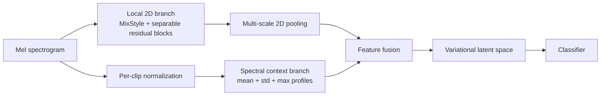

# 基于深度学习的水下声学目标分类

本项目实现了基于深度学习的船舶声学分类，包含 **PVSCNet**、**VesselCNN** 和 **DVSCNet** 三种模型，可分别训练并基于统一日志进行对比。

---

## 目录结构

```
Semi-Supervised-VAE-Acoustic-Classification/
├── data/                         # 原始数据
├── processed/                    # X.npy、y.npy、groups.npy、labels.npy
├── PVSCNet/
│   ├── model_PVSCNet.py
│   ├── train_PVSCNet.py
│   ├── checkpoint_best_PVSCNet.pt
│   ├── checkpoint_latest_PVSCNet.pt
│   ├── log_best_PVSCNet.json
│   ├── log_latest_PVSCNet.json
│   ├── curve_training_PVSCNet.png
│   └── matrix_confusion_PVSCNet.png
├── VesselCNN/                    # 同样的模型、训练及产物结构
├── DVSCNet/                      # 同样的模型、训练及产物结构
├── training_utils.py             # 三个训练入口共享的数据、训练和记录逻辑
├── plot_compare_models.py        # 从三个最新日志绘制对比曲线
├── curve_comparison_three_models.png
├── data_preprocess.py
└── README.md
```

每个模型目录都采用 `英文标识_模型名` 的命名方式。`latest` 文件记录最近一次训练，`best` 文件仅在相同数据划分、采样和归一化协议下，本次最佳验证准确率超过历史最佳时更新。

---

## 数据处理流程

1. **数据组织**  
   - `data/`目录下，每个子文件夹为一种船舶类型，文件夹名即类别名，内部为若干超长`.wav`音频文件。

2. **音频切分与特征提取**  
   - 使用`librosa`读取每个音频文件，采用**移动窗口法**按5秒（可调）切分为多个小片段。
   - **窗口重叠率**：50%，即相邻窗口重叠2.5秒，增加数据量并提供更好的时序覆盖。
   - 对每个片段提取梅尔频谱（Mel-spectrogram, n_mels=64），并转为dB刻度。
   - 所有片段的梅尔频谱组成特征集，类别名转为数字标签。

3. **特征保存**  
  - 处理结果分别保存为`processed/X.npy`（特征）、`processed/y.npy`（标签）、`processed/groups.npy`（原始 WAV 来源）和`processed/labels.npy`（类别名）。

运行如下命令完成数据预处理：

```bash
python data_preprocess.py
```

**数据增强效果**：
- 原方法：10秒音频 → 2个片段（0-5秒，5-10秒）
- 移动窗口法（50%重叠）：10秒音频 → 3个片段（0-5秒，2.5-7.5秒，5-10秒）
- 数据量提升约**2倍**，提高模型泛化能力

---

## 模型结构与训练方法

### 模型架构综述

本项目采用 **PVSCNet** 和双分支 **DVSCNet** 进行变分声学分类，并使用 **VesselCNN** 作为卷积基线。重构后的 DVSCNet 面向未见录音文件的域泛化，而不是继续扩大普通 CNN 的容量。

DVSCNet 包含两条互补路径：

- **局部二维分支**：深度可分离残差块提取时频纹理，经平均池化和最大池化保留粗粒度二维布局。
- **频谱上下文分支**：沿时间轴计算均值、标准差和最大值，再用 1D CNN 建模稳定的频谱包络。
- **域泛化机制**：GroupNorm 避免依赖训练批次统计；MixStyle 在特征空间混合录音域统计；SpecAug、标签平滑和小幅潜变量噪声共同抑制源文件记忆。
- **轻量融合**：两个分支融合后映射到 32 维变分隐空间，评估时使用均值向量保证预测确定性。


```mermaid
flowchart LR
  accTitle: DVSCNet Dual Branch Architecture
  accDescr: A spectrogram is processed by a local two-dimensional texture branch and a spectral context branch, then fused in a variational classifier.

  input["Mel spectrogram"] --> local["Local 2D branch<br/>MixStyle + separable residual blocks"]
  input --> normalize["Per-clip normalization"]
  normalize --> context["Spectral context branch<br/>mean + std + max profiles"]
  local --> pool["Multi-scale 2D pooling"]
  pool --> fusion["Feature fusion"]
  context --> fusion
  fusion --> latent["Variational latent space"]
  latent --> classifier["Classifier"]
```

#### 设计理念

水下声学信号具有高度的**变异性**和**不确定性**：
- **环境因素**：海水温度、盐度、深度导致的声速变化
- **传播路径**：多径传播、反射、折射造成的信号失真
- **背景噪声**：海洋生物、船舶噪声、水流声等干扰
- **传感器特性**：不同水听器的频率响应差异

PVSC-Net通过**隐变量学习**显式建模这些变异性，将声学信号编码为低维的隐变量表示，然后在隐变量空间中进行分类。这种方法的优势在于：
- **特征压缩**：将高维梅尔频谱压缩为16维隐变量，提取关键判别信息
- **正则化**：通过学习隐变量的分布参数（均值和方差），提供隐式正则化
- **鲁棒性**：隐变量表示对噪声和变异性更加鲁棒

#### 架构流程图

```
输入梅尔频谱 (1, H, W)
         │
         ▼
    卷积编码器
    (4层CNN)
  [特征提取路径]
         │
         ▼
   全连接层
 (特征 → 隐层)
         │
         ├──────────────┐
         ▼              ▼
    均值 μ(x)     对数方差 log(σ²(x))
         │              │
         └──────┬───────┘
                ▼
         重参数化采样
         z = μ + σ·ε
         (ε ~ N(0,I))
                │
                ▼
          分类器网络
       (3层全连接)
                │
                ▼
         类别logits
         (num_classes)
                │
                ▼
         Softmax概率
         p(c|x)
                │
                ▼
          分类预测 ŷ
```

#### 关键术语解释

**什么是隐变量 z？**
- 隐变量是模型学习到的低维特征表示（默认16维）
- 它捕捉了梅尔频谱的关键判别信息，同时对噪声和变异性具有鲁棒性
- 通过学习隐变量的分布参数（均值μ和方差σ²），模型可以量化特征的不确定性

**为什么使用重参数化？**
- 直接从正态分布采样 `z ~ N(μ, σ²)` 不可微分，无法反向传播
- 重参数化技巧：`z = μ + σ·ε`（其中 `ε ~ N(0,I)`），将随机性转移到ε
- 这使得采样过程可微分，允许梯度通过μ和σ反向传播

#### 核心组件说明

**1. 卷积编码器**
- **作用**：从梅尔频谱提取多尺度时频特征
- **输入**：梅尔频谱 `(batch, 1, H, W)`
- **输出**：高维特征向量 `(batch, feature_dim)`
- **架构**：4层卷积网络
  - Conv1: 1→32通道, stride=2, BN + LeakyReLU
  - Conv2: 32→64通道, stride=2, BN + LeakyReLU
  - Conv3: 64→128通道, stride=2, BN + LeakyReLU
  - Conv4: 128→256通道, stride=2, BN + LeakyReLU
- **特征图尺寸变化**：`(H,W) → (H/2,W/2) → (H/4,W/4) → (H/8,W/8) → (H/16,W/16)`

**2. 隐变量编码层**
- **作用**：将高维特征映射为低维隐变量的分布参数
- **输入**：展平的卷积特征 `(batch, feature_dim)`
- **输出**：均值 `μ ∈ R^16` 和对数方差 `log(σ²) ∈ R^16`
- **架构**：
  - 隐藏层: feature_dim → 512, LeakyReLU
  - 均值分支: 512 → 16
  - 方差分支: 512 → 16

**3. 重参数化采样**
```python
z = μ + σ · ε,  其中 ε ~ N(0, I)
```
- **作用**：从学习到的分布中采样隐变量
- **数学原理**：`N(μ, σ²)` 可以表示为 `μ + σ·N(0,1)`
- **可微性**：随机性仅在ε中，μ和σ的梯度可以正常计算

**4. 分类器网络**
- **作用**：从隐变量预测目标类别
- **输入**：隐变量 `z ∈ R^16`
- **输出**：类别logits `(batch, num_classes)`
- **架构**：3层全连接网络
  - FC1: 16 → 256, BN + LeakyReLU + Dropout(0.3)
  - FC2: 256 → 128, BN + LeakyReLU + Dropout(0.3)
  - FC3: 128 → num_classes（输出层）

### 网络详细参数

**输入**：单通道梅尔频谱图，形状为 `(1, H, W)`

**编码器架构**（以128×128输入为例）：
```
Input:        (1, 128, 128)
Conv1 + BN:   (32, 64, 64)    # stride=2下采样
Conv2 + BN:   (64, 32, 32)
Conv3 + BN:   (128, 16, 16)
Conv4 + BN:   (256, 8, 8)
Flatten:      (16384,)        # 256×8×8
FC_hidden:    (512,)
├─ FC_mu:     (16,)           # 均值向量
└─ FC_logvar: (16,)           # 对数方差向量
```

**分类器架构**：
```
Input:        (16,)           # 隐变量z
FC1 + BN:     (256,)
Dropout:      (256,)          # p=0.3
FC2 + BN:     (128,)
Dropout:      (128,)          # p=0.3
FC3:          (num_classes,)  # 输出logits
```

**参数量统计**（假设输入128×128，5个类别）：
- **编码器**: 约1.3M参数
- **分类器**: 约40K参数
- **总参数量**: 约1.34M参数

**输出**：
- 类别logits和Softmax概率 `p(c|x)`
- 隐变量分布参数 `μ, log(σ²)`
- 采样的隐变量 `z`

### 训练方法

#### 损失函数

PVSC-Net仅使用**分类损失（交叉熵）**进行端到端训练：

```python
Loss = CrossEntropy(logits, labels)
```

**为什么不使用重构损失和KL散度？**
- PVSC-Net专注于分类任务，不需要生成/重构能力
- 隐变量的正则化通过Dropout和BatchNorm实现
- 简化的损失函数使训练更加稳定和高效

#### 超参数配置

- **学习率**：1e-4（使用Adam优化器）
- **批大小**：256
- **训练轮数**：100
- **训练/验证划分**：80% / 20%（**分层采样**，确保各类别比例一致）
- **隐变量维度**：16
- **Dropout概率**：0.3（在分类器中）
- **随机种子**：42（确保可复现）
- **设备**：自动检测 GPU 或 CPU

#### 数据集划分策略

共享训练工具采用**类别分层的原始文件级划分**。同一个 WAV 生成的全部 50% 重叠窗口只能出现在训练集或验证集一侧：

```python
train_indices, val_indices = stratified_group_split(
  targets=y,
  groups=source_wav,
  val_split=0.2,
  seed=42,
)
```

**优势**：
- 消除相邻重叠窗口跨集合造成的数据泄漏
- 直接评估模型对未见原始录音的泛化能力
- 训练集 MinMax 统计量不读取验证文件
- 训练采样同时均衡类别和原始 WAV，避免长录音支配梯度

#### 训练过程

在项目根目录分别运行：

```bash
python PVSCNet/train_PVSCNet.py
python VesselCNN/train_VesselCNN.py
python DVSCNet/train_DVSCNet.py
```

所有入口都支持 `--epochs`、`--batch-size`、`--learning-rate`、`--val-split`、`--seed` 和 `--num-workers`。例如：

```bash
python DVSCNet/train_DVSCNet.py --epochs 30 --batch-size 64 --learning-rate 3e-4 --seed 2026
```

DVSCNet 还支持 `--z-dim`、`--weight-decay`、`--latent-noise-scale` 和 `--disable-spec-augment`。

每次训练结束后，模型目录会保存：

- `checkpoint_latest_模型名.pt`：最近一次训练结束时的权重
- `checkpoint_best_模型名.pt`：所有历史训练中的最佳权重
- `log_latest_模型名.json`：最近一次训练的配置、完整曲线和结果摘要
- `log_best_模型名.json`：历史最佳训练记录
- `curve_training_模型名.png`：本次训练损失和准确率曲线
- `matrix_confusion_模型名.png`：本次最佳 epoch 权重的混淆矩阵

三个模型训练完成后，在项目根目录运行：

```bash
python plot_compare_models.py
```

脚本读取三个 `log_latest_模型名.json`，生成根目录下的 `curve_comparison_three_models.png`。

---

## 结果可视化与模型表现

### 文件级无泄漏对比

最终对比使用相同的文件级分层划分、类别与源文件均衡采样、仅训练集拟合的 MinMax 归一化，以及种子 2026。验证集包含 14 个训练期间从未出现的原始 WAV，共 457 个片段。

| 模型 | 参数量 | 最佳轮次 | 验证准确率 | 宏平均 F1 |
| --- | ---: | ---: | ---: | ---: |
| PVSCNet | 5,687,140 | 13 | 59.30% | 59.78% |
| DVSCNet | 498,948 | 23 | **80.74%** | **81.61%** |

DVSCNet 的验证准确率提升 **21.44 个百分点**，参数量减少约 **91.2%**。PVSCNet 与 DVSCNet 在评估模式下都使用潜变量均值，保证同一 checkpoint 的结果可重复。该结果只适用于当前 63 个原始录音的文件级留出实验；由于源文件数量仍然有限，后续应使用更多录音和多次 GroupKFold 评估置信区间。完整迭代记录见 [docs/DVSCNet_Redesign_Experiment.md](docs/DVSCNet_Redesign_Experiment.md)。

### 模型对比曲线

三个模型最近一次训练过程的对比如下图所示：


- **分析**：曲线应结合日志中的 `split_strategy`、`train_sampling` 和 `feature_normalization` 解读，只有协议一致的运行可以直接比较。

### 混淆矩阵

#### PVSC-Net 混淆矩阵


#### VesselCNN 混淆矩阵


#### DVSCNet 混淆矩阵


- **分析**：最终文件级验证中，DVSCNet 在四个类别上的召回率均高于 PVSCNet，主要剩余混淆发生在 Cargo 与 Tanker 之间。

---

## 依赖环境

```
librosa>=0.9.0
numpy>=1.21.0
torch>=1.10.0
matplotlib>=3.4.0
scikit-learn>=1.0.0
```

安装依赖：

```bash
pip install -r requirements.txt
```

或手动安装：

```bash
pip install librosa numpy torch matplotlib scikit-learn
```

---

## 项目特色

1. **移动窗口采样**：50%重叠率有效增加数据量
2. **分层数据划分**：确保训练/验证集类别比例一致
3. **PVSC-Net架构**：概率变分方法显式建模声学特征的变异性
4. **端到端训练**：简化的损失函数，训练更稳定
5. **完整可复现**：固定所有随机种子，结果可重现
6. **详细日志**：训练过程输出详细的统计信息
7. **模型对比**：同时训练PVSC-Net和简单CNN，直观展示性能差异

---

## 参考

- [librosa: Python音频分析库](https://librosa.org/)
- [PyTorch: 深度学习框架](https://pytorch.org/)
- [DeepShip数据集](https://github.com/irfankamboh/DeepShip)
