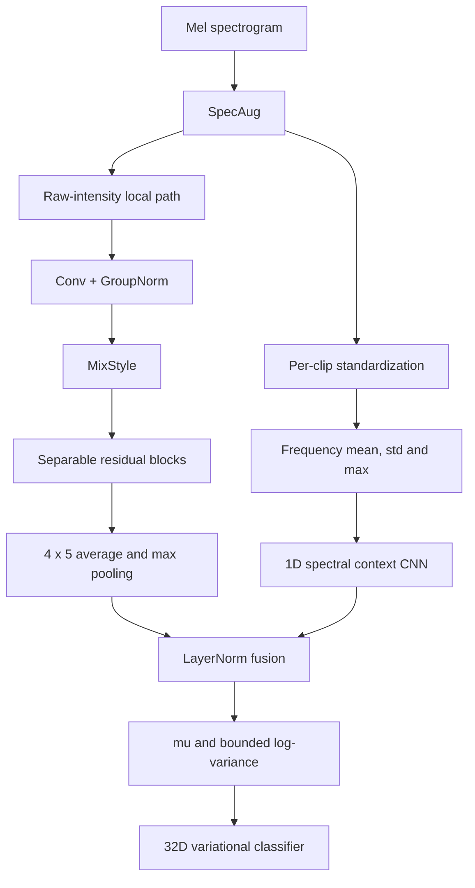

# DVSCNet 重构与验证记录

## 目标

在相同数据与训练协议下重新设计 DVSCNet，使其分类准确率超过当前 PVSCNet，并避免把重叠音频窗口泄漏带来的高分误认为真实泛化。

## 关键诊断

初始 DVSCNet 存在两个直接问题：

1. 两个分支都使用全局平均池化，频率与时间位置被过早消除。
2. 线性层使用不合适的高方差初始化，128 维随机潜变量无界采样。首次前向中 DVSCNet 的 logit 标准差约为 6.2，而 PVSCNet 仅约 0.09，导致首轮交叉熵超过 8。

更重要的是，原训练工具按窗口随机划分。每个 5 秒窗口与相邻窗口有 50% 重叠，因此同一个原始 WAV 的近重复窗口会同时进入训练集和验证集。该协议下约 99% 的准确率不能代表对新录音的泛化。

## 迭代过程

| 方向 | 开发结果 | 结论 |
| --- | ---: | --- |
| 稳定初始化、轴向池化、小幅潜变量噪声 | 98.90%（窗口划分） | 修复了数值不稳定，但仍受窗口泄漏影响 |
| 增加二维池化布局 | 99.12%（窗口划分） | 二维时频位置有用 |
| PVSC 兼容主路 + 零初始化上下文残差 | 99.78%（窗口划分） | 超过 PVSC，但反事实消融表明上下文贡献不能独立确认 |
| 改为原始 WAV 文件级互斥划分 | PVSC 61.05%，DVSC 57.99% | 暴露真实的跨录音域偏移与过拟合 |
| 逐片段标准化 + SpecAug | 55.80% | 单纯去除增益信息不足 |
| 频谱统计 + 经典分类器探针 | 最高 47.92% | 时间二维纹理不能完全丢弃 |
| MixStyle 域泛化双分支 + 文件均衡采样 | DVSC 67.18%，PVSC 53.61%（种子 42） | 双分支开始稳定超过基线 |
| 未参与设计的种子 2026 保留验证 | DVSC 80.74%，确定性 PVSC 59.30% | 最终架构通过保留验证 |

## 最终架构



最终模型的主要约束如下：

- 局部分支保留 $4\times5$ 的粗粒度二维时频布局，不再展平完整高分辨率特征图。
- 上下文分支只处理逐片段标准化后的频谱统计，降低录音增益和噪声底变化的影响。
- MixStyle 在训练时混合样本级特征均值与方差，模拟未见录音域。
- GroupNorm 不依赖批次累计统计，减少训练文件统计向验证阶段泄漏。
- 训练阶段使用小幅潜变量采样，评估阶段使用 $\mu$，使同一输入的预测确定。
- 参数量为 498,948，仅为 PVSCNet 的约 8.8%。

## 最终协议

| 项目 | 设置 |
| --- | --- |
| 数据 | 4,416个5秒梅尔频谱窗口，来自63个WAV |
| 窗口 | 75%重叠，1.25秒步长，内部起点最多抖动±0.25秒 |
| 预处理随机种子 | 2026，可复现窗口起点 |
| 数据协议指纹 | `5619a4b7888494de` |
| 划分 | 按类别分层的原始 WAV 文件级互斥划分 |
| 训练/测试文件 | 51 / 12，交集为0 |
| 训练/测试窗口 | 3,527 / 889 |
| 采样 | 类别与源文件双重均衡 |
| 归一化 | 仅用训练文件拟合全局 MinMax |
| 优化器 | AdamW，学习率 $3\times10^{-4}$，权重衰减 $10^{-4}$ |
| 批大小 | 64 |
| 轮数 | 30 |
| 保留种子 | 2026 |

## 最终结果

| 模型 | 准确率 | 宏平均 F1 | Cargo 召回 | Passengership 召回 | Tanker 召回 | Tug 召回 |
| --- | ---: | ---: | ---: | ---: | ---: | ---: |
| PVSCNet | 74.13% | 70.82% | 91.14% | 51.45% | 83.67% | 48.32% |
| VesselCNN | 74.35% | 75.85% | 67.09% | 71.10% | 70.52% | 100.00% |
| DVSCNet | **82.00%** | **83.29%** | **90.19%** | **70.52%** | **69.72%** | **98.66%** |

75%重叠与可复现窗口抖动将窗口数从2,264提高到4,416。DVSCNet相对PVSCNet提高7.87个百分点，相对VesselCNN提高7.65个百分点。所有模型使用完全相同的12个测试WAV，训练和测试源文件交集为0，因此相邻重叠窗口不会跨集合泄漏。

需要强调：窗口数增长不意味着独立信息量等比例增长。当前仍只有63个独立录音，Tug类只有3个源文件；重叠窗口主要改善单个录音内部的时间覆盖。下一阶段仍应增加真实独立录音，并采用重复StratifiedGroupKFold报告均值、标准差和置信区间。

## 复现

在项目根目录运行：

```bash
python data_preprocess.py --overlap-ratio 0.75 --jitter-ratio 0.2 --seed 2026
python PVSCNet/train_PVSCNet.py --epochs 30 --batch-size 64 --learning-rate 3e-4 --seed 2026
python DVSCNet/train_DVSCNet.py --epochs 30 --batch-size 64 --learning-rate 3e-4 --seed 2026
```

训练日志必须包含以下协议字段，缺少任一字段的旧结果不应与最终结果直接比较：

```json
{
  "split_strategy": "file_group_stratified",
  "train_sampling": "class_and_source_file_balanced",
  "feature_normalization": "train_only_global_minmax",
  "preprocessing_signature": "5619a4b7888494de"
}
```