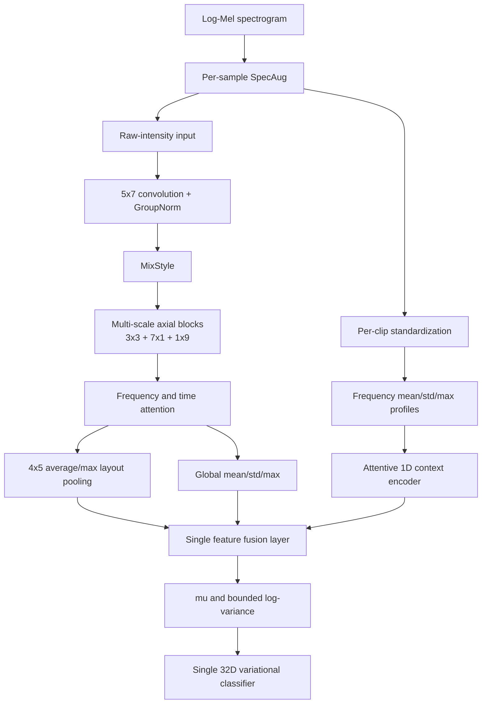

# DVSCNet 单模型重构与验证记录

## 目标

在相同数据、源 WAV 文件级互斥划分和训练协议下重构 DVSCNet，降低训练集与未见录音验证集之间的泛化差距。最终实现必须是单一模型、单一变分瓶颈和单一分类头，不使用旧模型集成、双 checkpoint 推理或 logits 融合。

## 关键诊断

当前数据包含4,416个重叠窗口，但只来自63个独立 WAV。旧 DVSCNet 在训练后期达到96.88%的训练准确率，而最佳验证准确率为77.95%，说明主要问题是跨录音域过拟合，而不是训练不足。

旧结构还存在两个建模问题：

1. 普通深度可分离卷积对频率轴和时间轴使用相同感受野，难以同时表达窄带谐波与长时间调制。
2. 变分方差分支只有随机采样，没有 KL 约束，训练目标与论文中的变分信息瓶颈并不完整。

## 消融与选择

| 方案 | 最佳验证准确率 | 结论 |
| --- | ---: | --- |
| 旧 DVSCNet | 77.95% | 基线，后期存在明显文件域过拟合 |
| 全输入逐片段标准化的纯轴向网络 | 76.04% | 去除了 Cargo/Tanker 判别所需的绝对谱强度 |
| 原始强度纯轴向网络 | 75.82% | 恢复学习速度，但缺少稳定频谱包络上下文 |
| 纯轴向网络 + 同流二维布局池化 | 73.23% | 只补布局不足以恢复跨录音泛化 |
| 单模型轴向编码 + 归一化频谱上下文特征融合 | **84.59%** | 同时保留绝对强度、二维位置与域稳健频谱形状 |

实验过程中曾验证不同特征表示具有误差互补性，但最终实现没有保留模型集成方案。当前代码只包含一个 DVSCNet，所有特征在唯一的融合层中合并，最后只经过一个变分瓶颈和一个分类头。

## 最终架构



主要组件如下：

- 多尺度轴向块并行使用 $3\times3$、$7\times1$ 和 $1\times9$ 深度卷积，分别建模局部时频纹理、跨频带谐波结构和时间调制。
- 频率轴与时间轴注意力在每个轴向块内重标定特征，不引入独立预测分支。
- 原始强度特征保留船型相关的谱能量线索；逐片段标准化只用于频谱上下文编码，降低录音增益和噪声底变化的影响。
- $4\times5$ 平均/最大池化保留粗粒度二维位置，全局均值、标准差和最大值补充整体统计。
- 所有特征在一个融合层中合并，之后只存在一个 $32$ 维变分瓶颈和一个分类头。
- 参数量为697,637，架构版本为 `single_stream_axial_context_v3`。

## 损失与正则

DVSCNet 使用带标签平滑的交叉熵和小权重 KL 信息瓶颈：

$$
\mathcal{L}=\mathcal{L}_{\mathrm{CE}}+\beta D_{\mathrm{KL}}\left(q_\phi(z\mid x)\,\|\,\mathcal{N}(0,I)\right),\qquad \beta=5\times10^{-4}.
$$

训练阶段采用0.05的潜变量噪声、0.4 Dropout、$10^{-3}$ AdamW权重衰减、GroupNorm、MixStyle和逐样本SpecAug。评估阶段直接使用 $\mu$，保证同一 checkpoint 的输出确定。

## 验证协议

| 项目 | 设置 |
| --- | --- |
| 数据 | 4,416个5秒 log-Mel 窗口，来自63个WAV |
| 输入尺寸 | $64\times157$ |
| 窗口 | 75%重叠，1.25秒步长，内部起点最多抖动±0.25秒 |
| 数据协议指纹 | `5619a4b7888494de` |
| 划分 | 按类别分层的源 WAV 文件级互斥划分 |
| 训练/验证文件 | 51 / 12，交集为0 |
| 训练/验证窗口 | 3,527 / 889 |
| 训练采样 | 类别与源文件均衡，每个源文件每轮最多128个窗口且无放回 |
| 特征归一化 | 仅使用训练文件拟合全局 MinMax |
| 优化器 | AdamW，学习率 $3\times10^{-4}$，权重衰减 $10^{-3}$ |
| 批大小 | 64 |
| 随机种子 | 2026 |

## 最终结果

| 模型 | 参数量 | 最佳轮次 | 准确率 | 宏平均 F1 |
| --- | ---: | ---: | ---: | ---: |
| PVSCNet | 531,108 | 14 | 78.40% | 80.00% |
| VesselCNN | 617,828 | 22 | 77.62% | 78.68% |
| DVSCNet | 697,637 | 27 | **84.59%** | **84.34%** |

DVSCNet 相比旧架构提高6.64个百分点，相比当前 PVSCNet 提高6.19个百分点，相比 VesselCNN 提高6.97个百分点。新最佳 checkpoint 已用当前单模型结构严格加载并独立复算，准确率与日志完全一致。

| 类别 | 召回率 |
| --- | ---: |
| Cargo | 90.51% |
| Passengership | 67.63% |
| Tanker | 82.47% |
| Tug | 95.30% |

主要剩余错误是 Passengership 与 Tanker 之间的混淆。当前 Tug 类只有3个独立源文件，因此单次文件级划分仍有较高方差；正式论文应进一步增加独立录音，并使用重复 StratifiedGroupKFold 报告均值、标准差和置信区间。

## 复现

在项目根目录运行：

```bash
python data_preprocess.py --overlap-ratio 0.75 --jitter-ratio 0.2 --seed 2026
python DVSCNet/train_DVSCNet.py --epochs 35 --batch-size 64 --learning-rate 3e-4 --seed 2026 --weight-decay 1e-3 --dropout 0.4 --kl-weight 5e-4 --latent-noise-scale 0.05
```

训练日志必须同时匹配以下字段，旧架构 checkpoint 不应与当前模型混用：

```json
{
  "architecture_version": "single_stream_axial_context_v3",
  "split_strategy": "file_group_stratified",
  "train_sampling": "class_source_capped_without_replacement_128",
  "feature_normalization": "train_only_global_minmax",
  "preprocessing_signature": "5619a4b7888494de"
}
```