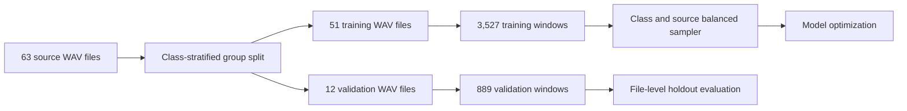
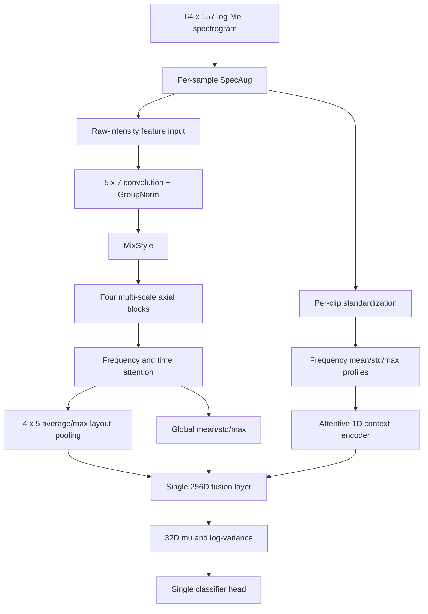

# 基于单模型DVSC-Net的水下船舶声学目标分类研究

## 摘要

水下船舶声学信号受传播环境、背景噪声、传感器响应和目标工况变化影响，同一类别在不同录音文件之间可能存在明显域偏移。针对普通卷积网络容易记忆录音级幅度和纹理统计、训练准确率显著高于未见录音验证准确率的问题，本文提出单模型多尺度轴向变分声谱分类网络DVSC-Net。该模型以5秒log-Mel频谱为输入，在同一网络中使用多尺度轴向深度卷积分别建模局部时频纹理、跨频带谐波结构和长时间调制，通过频率轴与时间轴注意力进行特征重标定，并联合粗粒度二维布局、全局统计和逐片段标准化后的频谱上下文。所有特征在唯一的融合层中合并，随后进入一个32维变分信息瓶颈和一个分类头，不使用旧模型集成、双checkpoint推理或logits融合。实验采用63个源WAV生成的4,416个重叠窗口，并按源文件进行类别分层互斥划分，以避免相邻窗口跨集合泄漏。在固定种子2026的51/12个训练/验证WAV划分上，重构后的DVSC-Net取得84.59%的最佳验证准确率和84.34%的宏平均F1，相比旧DVSC-Net提高6.64个百分点，相比PVSCNet和VesselCNN分别提高6.19和6.97个百分点。结果表明，面向时频轴差异设计感受野，并同时保留绝对谱强度和归一化频谱形状，有助于提高模型对未见录音文件的泛化能力。由于当前结果来自参与模型选择的固定验证划分，尚不能等同于独立测试性能；后续仍需通过重复StratifiedGroupKFold和更多独立录音评估置信区间。

**关键词：** 水下声学目标分类；log-Mel频谱；轴向卷积；域泛化；变分信息瓶颈

## 一、研究背景与问题定义

水下船舶声学目标分类是海洋环境监测、航运管理和被动声学感知中的重要任务。与图像数据相比，水声信号具有更强的非平稳性。传播距离、海况、多径效应、背景噪声和水听器频率响应都会改变观测到的频谱分布，使模型容易学习到录音文件或采集条件相关的统计特征，而不是稳定的船型特征。

本项目使用Cargo、Passengership、Tanker和Tug四类船舶录音。原始音频被切分为5秒窗口并转换为64频带log-Mel频谱。75%的窗口重叠率能够增加单个录音内部的时间覆盖，但相邻窗口共享大量声学内容，因此窗口数量不能被视为独立样本数量。如果直接按窗口随机划分训练集和验证集，同一源WAV的近重复窗口会同时出现在两侧，得到的高准确率不能代表模型对新录音的泛化能力。本文因此把源WAV视为最小独立分组，所有评估均采用源文件级互斥划分。

旧DVSC-Net在训练后期的训练准确率达到96.88%，而最佳文件级验证准确率仅为77.95%。这一差距说明模型容量并非主要瓶颈，核心问题是跨录音域过拟合。本文的目标不是简单增加网络深度，而是根据声谱图频率轴与时间轴的不同物理含义重构特征提取方式，并通过完整的变分正则和文件级训练协议提高泛化能力。

## 二、数据处理与评估协议

### （一）音频切分与log-Mel表示

所有音频统一重采样到16 kHz。对每个源WAV使用长度为5秒的滑动窗口进行切分，窗口步长为1.25秒，对应75%的重叠率。除首尾窗口外，中间窗口起点在步长的20%范围内进行带随机种子的抖动，最大偏移为0.25秒。该过程最终生成4,416个窗口，来源于63个独立WAV。

对于每个窗口，首先计算Mel功率谱，再转换为对数分贝尺度，得到尺寸为$64\times157$的单通道特征矩阵。设第$m$个Mel滤波器在时间帧$t$上的功率为$S(m,t)$，则log-Mel特征可写为

$$
X(m,t)=10\log_{10}\frac{S(m,t)}{S_{\mathrm{ref}}}.
$$

训练工具只使用训练文件拟合全局MinMax统计量，验证文件不参与归一化参数估计。模型内部还对频谱上下文输入进行逐片段标准化，但原始强度二维特征流保留训练集MinMax后的绝对谱能量信息。

### （二）源文件级互斥划分

数据划分以源WAV为组，并在每个类别内部选择接近20%窗口数量的源文件作为验证集。固定种子2026时，训练集包含51个WAV和3,527个窗口，验证集包含12个WAV和889个窗口，训练与验证源文件交集为0。当前数据协议指纹为`5619a4b7888494de`。

训练阶段采用类别与源文件联合均衡采样。每个源文件每轮最多选择128个不重复窗口，各类别最终使用相同数量的训练窗口，以减少长录音和高重叠相邻窗口对梯度的支配。该策略不能增加独立信息量，但能够降低单个源文件被过度采样造成的偏置。



## 三、单模型DVSC-Net架构

### （一）总体结构

最终DVSC-Net的架构版本为`single_stream_axial_context_v3`，参数量为697,637。模型只有一个PyTorch模型实例、一个特征融合层、一个变分瓶颈和一个分类头。网络内部同时处理原始强度特征与逐片段标准化频谱统计，但这些表示只在特征层进行联合建模，不产生两个独立预测，因此不属于模型集成。



### （二）多尺度轴向卷积

log-Mel频谱的纵轴表示频率，横轴表示时间。普通方形卷积对两个轴采用相同的局部感受野，不能显式区分窄带谐波结构和较长时间尺度的调制模式。为此，每个轴向残差块将投影后的特征分别送入$3\times3$、$7\times1$和$1\times9$深度卷积。三个结果取平均后通过归一化、SiLU激活、轴注意力和$1\times1$卷积整合，并与捷径连接相加。

设输入特征为$H$，局部、频率和时间卷积分别记为$\mathcal{C}_{3\times3}$、$\mathcal{C}_{7\times1}$和$\mathcal{C}_{1\times9}$，则块内多尺度特征为

$$
H_{\mathrm{ms}}=\frac{1}{3}\left(\mathcal{C}_{3\times3}(H)+\mathcal{C}_{7\times1}(H)+\mathcal{C}_{1\times9}(H)\right).
$$

频率轴注意力根据时间平均后的频率轮廓生成权重，时间轴注意力根据频率平均后的时间轮廓生成权重。两个权重共同作用于二维特征图，使网络能够在不同样本中动态强调稳定频带和关键时间区域。

### （三）二维布局与频谱上下文

轴向编码器输出128通道特征图。模型先用$1\times1$卷积压缩到32通道，再分别进行$4\times5$自适应平均池化和最大池化，得到保留粗粒度时频位置的二维布局特征。同时从128通道特征图计算全局均值、标准差和最大值，用于描述整体激活统计。

另一组上下文特征来自逐片段标准化后的输入。模型沿时间轴计算每个Mel频带的均值、标准差和峰值，将三种轮廓输入一维卷积编码器，并通过注意力统计池化得到160维频谱上下文。该表示对整体增益缩放不敏感，能够补充跨录音更稳定的频谱形状信息。原始强度二维特征、二维布局、全局统计和归一化频谱上下文最终在同一个256维融合层中联合建模。

### （四）变分信息瓶颈

融合特征分别映射为32维均值$\mu$和对数方差$\log\sigma^2$。训练阶段使用受控重参数化采样

$$
z=\mu+\alpha\epsilon\odot\exp\left(\frac{1}{2}\log\sigma^2\right),\qquad \epsilon\sim\mathcal{N}(0,I),\quad \alpha=0.05.
$$

评估阶段直接使用$z=\mu$，从而保证同一输入和同一checkpoint产生确定性结果。训练损失由带0.05标签平滑的交叉熵与KL信息瓶颈组成：

$$
\mathcal{L}=\mathcal{L}_{\mathrm{CE}}+\beta D_{\mathrm{KL}}\left(q_\phi(z\mid x)\,\|\,\mathcal{N}(0,I)\right),\qquad \beta=5\times10^{-4}.
$$

KL项使方差分支受到明确约束，避免仅靠分类损失时隐变量方差退化为无约束噪声源。优化器采用AdamW，初始学习率为$3\times10^{-4}$，权重衰减为$10^{-3}$，Dropout为0.4。验证损失停滞时学习率减半，梯度范数裁剪阈值为5.0。

### （五）域泛化正则

模型使用GroupNorm代替依赖批次累计统计的BatchNorm。MixStyle以0.3的概率混合样本级特征均值与标准差，以模拟不同录音环境的统计变化。SpecAug按样本独立执行，最大频率遮挡宽度为4，最大时间遮挡宽度为8，执行概率为0.3。与对整个批次使用相同遮挡相比，逐样本增强能够产生更丰富的局部缺失模式，同时避免过强扰动破坏小样本训练。

## 四、实验结果

### （一）整体性能

三个模型使用相同的预处理、源文件划分、训练采样和归一化协议。表1报告各模型在固定文件级验证集上的最佳结果。

**表1 统一文件级协议下的模型性能**

| 模型 | 参数量 | 最佳轮次 | 验证准确率 | 宏平均F1 |
| --- | ---: | ---: | ---: | ---: |
| PVSCNet | 531,108 | 14 | 78.40% | 80.00% |
| VesselCNN | 617,828 | 22 | 77.62% | 78.68% |
| DVSCNet | 697,637 | 27 | **84.59%** | **84.34%** |

重构后的DVSC-Net比旧DVSC-Net的77.95%提高6.64个百分点，比PVSCNet提高6.19个百分点，比VesselCNN提高6.97个百分点。最佳checkpoint在当前单模型代码中使用严格模式加载成功，独立复算得到的准确率与日志完全一致。


**图1 三模型训练过程曲线对比。** 曲线来自相同数据协议下各模型最近一次训练日志。

### （二）类别级表现

**表2 DVSC-Net类别级召回率**

| 类别 | 验证样本数 | 正确样本数 | 召回率 |
| --- | ---: | ---: | ---: |
| Cargo | 316 | 286 | 90.51% |
| Passengership | 173 | 117 | 67.63% |
| Tanker | 251 | 207 | 82.47% |
| Tug | 149 | 142 | 95.30% |


**图2 DVSC-Net最佳checkpoint的文件级验证混淆矩阵。** Cargo与Tug具有较高召回率，主要剩余错误发生在Passengership与Tanker之间。173个Passengership窗口中有41个被预测为Tanker，251个Tanker窗口中有25个被预测为Passengership。这表明两类船舶在当前录音条件下仍具有相近的谱包络和时间调制特征，是后续数据扩充和判别学习的重点。

### （三）训练与验证差距

新模型在第27轮取得84.59%的最佳验证准确率，对应训练准确率为96.97%。虽然最佳验证性能显著提高，但训练与验证之间仍存在约12.38个百分点的差距，说明跨录音域过拟合尚未完全消除。当前训练器保存按验证准确率选择的最佳checkpoint，因此后续轮次的训练准确率继续上升不会覆盖已验证的最佳权重。

这一结果同时说明，单次固定划分的准确率不足以完整描述模型稳定性。模型结构和超参数已经在种子2026的验证集上迭代选择，因此84.59%应被称为固定分组验证结果，而不是未参与调参的独立测试结果。正式论文需要增加独立测试集，或采用重复StratifiedGroupKFold并报告均值、标准差和置信区间。

## 五、讨论

消融实验表明，单纯扩大轴向卷积容量并不能自动提高泛化性能。将整个输入逐片段标准化后，模型的最佳验证准确率下降到76.04%，说明绝对谱强度仍包含区分Cargo和Tanker的有效信息。只保留原始强度轴向编码时，最佳准确率为75.82%；在同一特征流末端加入二维布局池化后仍只有73.23%。最终模型的提升来自三类信息的联合：原始强度特征保留船型相关能量分布，多尺度轴向卷积建模不同方向的时频模式，归一化频谱上下文提供对录音增益和噪声底更稳健的频谱形状。

当前结果不支持“模型已经解决跨域泛化问题”的强结论。首先，63个独立WAV仍然较少，特别是Tug类只有3个源文件，单次划分中的类别指标容易受具体文件影响。其次，75%重叠窗口增加的是单个录音内部覆盖，而不是独立录音数量。最后，当前验证集参与了架构和超参数选择，存在模型选择偏差。后续工作应优先增加独立录音、控制采集设备和海况元数据，并采用重复分组交叉验证；在此基础上再评估自监督声学预训练、频带扰动和监督式对比学习等方法。

## 六、结论

本文针对DVSC-Net训练准确率高而未见录音验证准确率低的问题，完成了模型架构和训练目标的重构。最终网络为单一DVSC-Net，不使用旧模型集成或双预测头。模型通过多尺度轴向卷积区分频率与时间模式，通过轴注意力、二维布局池化和全局统计保留时频结构，通过归一化频谱上下文提高对录音条件变化的稳健性，并以KL正则约束32维变分隐空间。

在无源文件交叉的固定验证协议下，重构模型取得84.59%的准确率和84.34%的宏平均F1，显著优于旧DVSC-Net、PVSCNet和VesselCNN。结果证明，针对声谱图两个轴的物理差异设计感受野，并在单一模型的特征层联合原始强度与归一化频谱形状，是改善当前数据集泛化性能的有效方向。该结论仍需在更多独立录音和重复分组评估中验证。

## 七、复现实验

数据预处理命令为：

```bash
python data_preprocess.py --overlap-ratio 0.75 --jitter-ratio 0.2 --seed 2026
```

最终DVSC-Net训练命令为：

```bash
python DVSCNet/train_DVSCNet.py --epochs 35 --batch-size 64 --learning-rate 3e-4 --seed 2026 --weight-decay 1e-3 --dropout 0.4 --kl-weight 5e-4 --latent-noise-scale 0.05
```

可比较实验必须同时匹配架构版本`single_stream_axial_context_v3`、数据协议指纹`5619a4b7888494de`、文件级分层划分`file_group_stratified`、训练采样`class_source_capped_without_replacement_128`和仅训练集拟合的全局MinMax归一化。