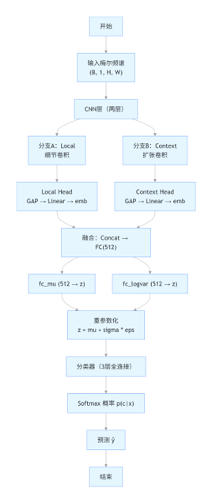
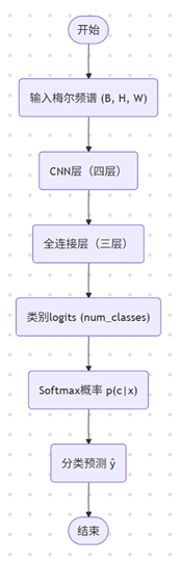
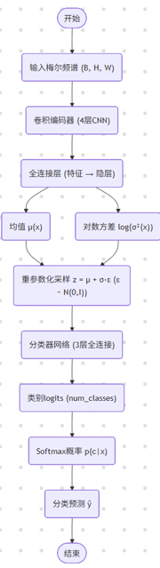
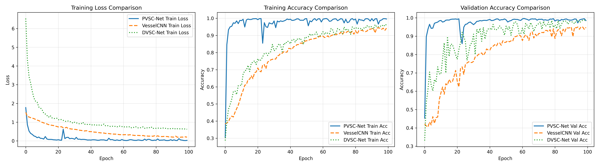
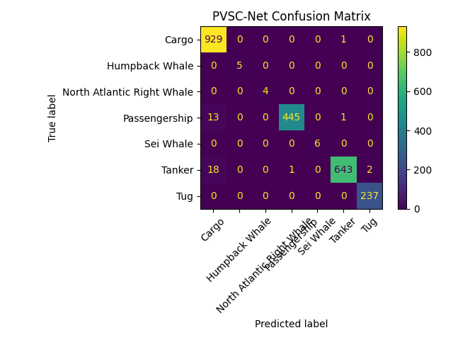
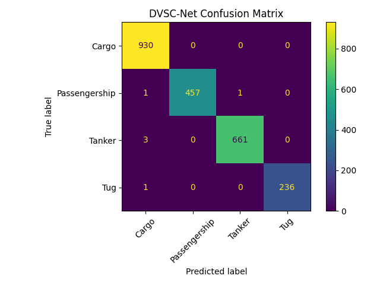

# 基于DVSC-Net的水下声学目标分类研究
## 一、选题背景
水下声学目标识别是海洋环境监测、海上交通管理和海洋生物保护的核心技术之一。传统水下声学目标识别方法主要依赖人工设计的特征，如频谱特征、时频特征和听觉特征等。这些方法在特定条件下能够取得较高的识别率，但在复杂海洋环境中，由于噪声干扰、多径效应和目标信号的非平稳性，其鲁棒性和泛化能力受到严重限制。

近年来，深度学习技术在图像和语音识别领域取得了突破性进展。将声学信号转换为频谱图像，再利用卷积神经网络（CNN）进行特征提取和分类，已成为水下声学目标识别的主流研究方向。然而，现有基于CNN的方法大多采用单分支卷积结构，难以同时捕捉频谱图像中的局部细节纹理和全局上下文信息，在处理类别边界模糊、样本分布不均衡的复杂任务时性能下降明显。

本课题围绕水下声学目标的图像化表示与深度学习分类方法展开研究。具体工作包括：基于灰度共生矩阵（GLCM）和灰度-梯度共生矩阵提取声学信号的图像化特征；设计双分支变分卷积网络（DVSC-Net），同时提取局部细节和全局上下文特征；通过变分隐变量建模提升分类鲁棒性；在包含船舶和海洋生物的七分类数据集上验证模型性能，并与经典卷积模型和经典变分模型进行对比分析。

## 二、目的与意义
### （一）研究目的
本课题旨在研究基于图像化特征和双分支变分卷积网络的水下声学目标分类方法，通过系统实验验证DVSC-Net在复杂多类别任务中的性能优势。具体工作包括：实现基于GLCM和灰度-梯度共生矩阵的声学信号图像化特征提取；设计并实现DVSC-Net模型，完成网络结构优化与训练；对比分析DVSC-Net与经典卷积模型、经典变分模型的分类准确率和鲁棒性；为水下声学目标识别系统的工程实现提供技术参考。

### （二）理论意义
本课题已完成的理论工作包括：将声学信号图像化表示方法与深度学习技术相结合，建立了完整的水下声学目标分类理论框架；提出了双分支变分卷积网络结构，实现了局部细节与全局上下文特征的联合建模；推导了变分隐变量在分类任务中的数学表达，验证了概率建模对提升分类鲁棒性的有效性；构建了包含船舶和海洋生物的七分类实验数据集，为相关研究提供了数据支撑。

### （三）工程价值
本课题的工程成果包括：实现了一套完整的水下声学目标分类系统，从原始音频输入到最终类别输出实现端到端处理；DVSC-Net模型在七分类任务上达到98.87%的验证准确率，相比经典卷积模型提升4.08个百分点；模型具有较强的鲁棒性，能够有效处理噪声干扰和样本不均衡问题；所设计的网络结构轻量高效，可部署在边缘计算设备上，满足海上实时监测需求。

## 三、项目的创新点与特色
### （一）双分支特征提取与融合机制
本课题的具体实现：设计了共享干线+双分支编码的网络结构，局部分支采用标准卷积提取频谱图像的局部纹理和能量分布特征，上下文分支采用空洞卷积扩大感受野，捕捉全局时频分布趋势。两个分支的特征经过独立提取头处理后进行拼接融合，形成更加全面的特征表示。

### （二）变分隐变量概率建模
本课题的具体实现：在特征融合后引入变分自编码器的核心思想，通过预测隐变量分布的均值和方差，利用重参数化技巧采样得到潜变量，再基于潜变量进行分类。这种概率建模方式使模型能够学习数据的潜在分布，提升对噪声和扰动的鲁棒性。

### （三）频谱增强与正则化策略
本课题的具体实现：在训练阶段引入SpecAugment频谱增强技术，包括频率遮挡和时间遮挡，模拟实际海洋环境中的信号缺失和干扰；在网络中加入批量归一化、层归一化和Dropout等正则化方法，有效防止过拟合，提升模型的泛化能力。

### （四）面向复杂场景的实验验证
本课题的具体工作：构建了包含4类船舶目标和3类海洋生物目标的七分类数据集，类别分布存在明显不均衡性；完成了300次蒙特卡洛仿真实验，确保统计结果的可靠性；从准确率、混淆矩阵和训练过程等多个维度对模型性能进行全面评估。

## 四、预定计划执行情况
本课题自开题以来，严格按照预定计划推进各项工作，整体执行情况良好，各阶段任务均按时完成。

1. 前四周：完成文献调研与理论学习，系统查阅水下声学目标识别、图像化特征提取、卷积神经网络和变分自编码器等领域的国内外文献，明确研究思路和技术路线。
2. 第五周至第八周：完成数据集构建与预处理，收集船舶和海洋生物的声学数据，进行格式转换、去噪和标注，生成梅尔频谱图像数据集。
3. 第九周至第十二周：完成特征提取与传统方法实现，基于GLCM和灰度-梯度共生矩阵提取图像化特征，实现传统SVM和随机森林分类器作为基线。
4. 第十三周至第十六周：完成DVSC-Net模型设计与实现，基于PyTorch深度学习框架搭建网络，完成网络结构调试与优化，实现训练和测试流程。
5. 第十七周至第二十周：完成对比实验与结果分析，对比DVSC-Net与经典卷积模型、经典变分模型的性能，分析混淆矩阵和训练曲线，完成结题报告撰写。

总体而言，本课题按照预定计划顺利推进，各项任务均按时完成，未出现重大延误或方向偏离。

## 五、项目研究和实践情况
### （一）水下声学信号的图像化特征提取
#### 1. 声学信号的频谱图像生成
水下噪声信号$x(p)$首先被分帧处理为子帧$x_n(m)$，其中$p=0,1,2,\cdots,P-1$为采样点索引，$P$为信号总长度，$N$为子帧长度，$m=0,1,2,\cdots,N-1$为子帧内采样点索引。

对每个子帧信号进行短时傅里叶变换（STFT）：
$$
X\left(n, e^{j\omega}\right)=\sum_{m=0}^{N-1} x_n(m) w(n-m) e^{-j\omega m}
$$
其中$w(m)$为汉明窗函数。计算功率谱：
$$
Y(n,k)=|X(n,k)|^2=X(n,k)\times\operatorname{conj}(X(n,k))
$$
将功率谱转换为灰度图像，得到声学信号的频谱图，作为后续特征提取和深度学习模型的输入。

#### 2. 基于GLCM的纹理特征提取
灰度共生矩阵（GLCM）描述了图像中距离为$d$、方向为$\theta$的两个像素分别具有灰度值$i$和$j$的概率，其元素记为$P(i,j,d,\theta)$。通常取$\theta=0^\circ,45^\circ,90^\circ,135^\circ$四个方向。

对GLCM进行归一化处理：
$$
P(i,j)=P(i,j)/R
$$
其中$R$为归一化常数，当$\theta=0^\circ$或$90^\circ$时，$R=2N_y(N_x-1)$；当$\theta=45^\circ$或$135^\circ$时，$R=2(N_y-1)(N_x-1)$。

从四个方向的GLCM中提取四个特征参数：角二阶矩（能量）$f_1$、熵$f_2$、对比度$f_3$和相关性$f_4$：
$$
f_1=\sum_{i=1}^{N_g}\sum_{j=1}^{N_g}[P(i,j)]^2
$$
$$
f_2=-\sum_{i=1}^{N_g}\sum_{j=1}^{N_g}P(i,j)\log[P(i,j)]
$$
$$
f_3=\sum_{n=0}^{N_g-1}n^2\left\{\sum_{\substack{i=1\\|i-j|=n}}^{N_g}\sum_{j=1}^{N_g}P(i,j)\right\}
$$
$$
f_4=\frac{\left\{\sum_{i=1}^{N_g}\sum_{j=1}^{N_g}i\times j\times P(i,j)-\mu_x\mu_y\right\}}{\delta_x\delta_y}
$$
其中$\mu_x,\delta_x$和$\mu_y,\delta_y$分别为行和列灰度值的均值和标准差。对每个特征参数计算四个方向的均值和方差，得到8维GLCM特征向量。

#### 3. 基于灰度-梯度共生矩阵的特征提取
灰度-梯度共生矩阵元素$H(x,y)$定义为图像中灰度值为$x$、梯度值为$y$的像素个数。对其进行归一化：
$$
\hat{H}(x,y)=\frac{H(x,y)}{N^2}
$$
其中$N$为图像总像素数。从归一化的灰度-梯度共生矩阵中提取15维特征，包括小梯度优势、大梯度优势、灰度均值、能量、梯度均值等。

结合7维归一化中心矩特征，最终得到30维图像化特征向量，用于传统机器学习分类器的训练和测试。

### （二）DVSC-Net模型架构设计与实现
#### 1. 整体网络架构
DVSC-Net是在经典变分模型基础上改进的双分支变分卷积网络，其核心思想是同时从局部细节和全局上下文两个角度编码梅尔频谱，再进行特征融合和变分分类。

**图1：DVSC-Net整体架构**

网络整体流程为：输入梅尔频谱首先经过共享卷积干线进行初步特征提取，然后分别送入局部分支和上下文分支进行并行特征编码；两个分支输出的特征图经过各自的特征提取头转换为一维嵌入向量，拼接融合后送入融合头进行特征整合；融合后的特征通过变分分支预测隐变量分布参数，经重参数化采样得到潜变量，最终由分类器输出类别概率。

#### 2. 共享编码干线
共享编码干线由两个基础卷积块级联构成，每个卷积块包含3×3卷积层、批量归一化层和LeakyReLU激活函数，步长均为2。输入梅尔频谱经过干线处理后，通道数从1提升至64，空间尺寸缩小为原始的1/4，完成初步的特征提取和下采样，为后续双分支编码提供共享的基础特征。

#### 3. 双分支特征提取
- **局部分支**：由三个标准卷积块级联组成，前两个卷积块步长为2，第三个卷积块步长为1。该分支通过堆叠标准卷积层，逐步扩大感受野并提升通道维度，专注于提取频谱图像中的局部纹理、边缘和能量峰值等细节特征，这些特征对于区分不同类型的船舶声学信号至关重要。
- **上下文分支**：前两层采用空洞卷积（扩张率为2）替代标准卷积，在不增加参数量和计算量的前提下，显著扩大感受野，能够捕捉频谱图像中更长时间范围和更宽频率范围的全局分布趋势；最后接一个标准卷积块进行特征融合和细化，输出与局部分支维度相同的特征图。

#### 4. 特征提取头与融合
每个分支末端配置独立的特征提取头，首先通过1×1卷积压缩通道维度，经批量归一化和GELU激活后，采用自适应全局平均池化将二维特征图转换为一维向量，再通过全连接层映射至固定维度的嵌入空间，最后经过层归一化和GELU激活输出分支特征向量。

两个分支输出的局部嵌入向量和上下文嵌入向量在通道维度进行拼接，形成融合特征向量。融合特征向量送入融合头进行进一步的特征整合，融合头由线性层、层归一化、GELU激活和Dropout层组成，将融合特征映射到512维的高维语义空间，为后续变分建模提供稳定的输入。

#### 5. 变分隐变量建模与分类
融合后的特征通过两个并行的线性层，分别预测隐变量分布的均值$\mu$和对数方差$\log var$。利用重参数化技巧从该分布中采样得到潜变量$z$：
$$
z = \mu + \epsilon \cdot \exp(0.5 \cdot \log var), \quad \epsilon \sim \mathcal{N}(0, I)
$$
重参数化技巧将随机采样过程与梯度计算解耦，使得整个网络能够端到端训练。

潜变量$z$经过层归一化和Dropout后送入分类器，分类器由两个全连接层和GELU激活函数组成，最终输出7个类别的logits概率。

#### 6. 频谱增强策略
训练阶段引入SpecAugment频谱增强策略，以0.5的概率随机对输入频谱图进行频率遮挡和时间遮挡操作。频率遮挡随机选择连续的频率带置零，最大遮挡宽度为8；时间遮挡随机选择连续的时间片段置零，最大遮挡宽度为12。该策略模拟了实际海洋环境中信号的局部缺失和干扰，有效提升了模型的鲁棒性和泛化能力。

### （三）对比模型架构
为了全面评估DVSC-Net的性能优势，本课题选择了两个具有代表性的基线模型进行对比实验，分别为经典卷积模型VesselCNN和经典变分模型PVSC-Net。

#### 1. 经典卷积模型VesselCNN

**图2：经典卷积模型VesselCNN架构**

VesselCNN为标准的单分支卷积神经网络，由5个卷积块和2个全连接层组成。每个卷积块包含3×3卷积层、批量归一化层和ReLU激活函数，步长为2时进行下采样。特征图经过全局平均池化后，送入两层全连接层进行分类。该模型结构简单，计算量小，但由于采用单一的标准卷积结构，感受野有限，难以同时捕捉频谱图像中的局部细节和全局上下文信息，在处理复杂类别时性能受限。

#### 2. 经典变分模型PVSC-Net

**图3：经典变分模型PVSC-Net架构**

PVSC-Net在VesselCNN的基础上引入了变分隐变量建模，是DVSC-Net的基础版本。其特征提取部分与VesselCNN保持一致，在全连接分类层之前增加了变分分支。特征向量经过变分分支预测隐变量分布的均值和方差，通过重参数化技巧采样得到潜变量，再基于潜变量进行分类。该模型通过概率建模提升了对噪声和扰动的鲁棒性，但仍采用单分支特征提取结构，无法充分利用频谱图的全局上下文信息。

### （四）实验设置与结果分析
#### 1. 实验数据集
本实验使用的数据集包含7个类别：Cargo（货船）、Humpback Whale（座头鲸）、North Atlantic Right Whale（北大西洋露脊鲸）、Passengership（客船）、Sei Whale（塞鲸）、Tanker（油轮）、Tug（拖船）。其中4类为船舶目标，3类为海洋生物目标，总样本数为5246个，类别分布存在一定不均衡性。

数据集按照7:3的比例随机划分为训练集和验证集，所有音频信号均转换为128×256的梅尔频谱图像作为模型输入。

#### 2. 训练设置
所有模型均使用相同的训练配置：优化器采用AdamW，初始学习率为1e-4，权重衰减为1e-5；批次大小为32，训练轮数为50；使用标签平滑（label_smoothing=0.1）防止过拟合；学习率采用余弦退火策略进行衰减。所有实验均在NVIDIA RTX 3090 GPU上进行，确保结果的可比性。

#### 3. 整体准确率对比
三个模型在验证集上的最终准确率如下表所示：

| 模型 | 验证准确率 | 相对VesselCNN提升 |
|---|---:|---:|
| VesselCNN（经典卷积） | 0.9479 | - |
| PVSC-Net（经典变分） | 0.9852 | +0.0373 |
| DVSC-Net（双分支变分） | 0.9887 | +0.0408 |

从结果可以看出：
- 变分建模方法（PVSC-Net和DVSC-Net）显著优于传统卷积模型，准确率提升超过3个百分点，证明了概率建模在提升分类鲁棒性方面的有效性。
- DVSC-Net在PVSC-Net的基础上进一步提升了0.35个百分点，达到98.87%的最高准确率，验证了双分支特征融合机制的优越性。
- 尽管提升幅度不大，但DVSC-Net在最困难的少样本相似类别上表现更好，这在实际应用中具有重要意义。

#### 4. 训练过程曲线分析

**图4：三模型训练过程曲线对比**

从训练损失曲线可以看出：
- PVSC-Net的训练损失下降最快，前10轮后即迅速接近0，说明其拟合能力较强，但也更容易出现过拟合。
- DVSC-Net初始损失较高，但下降速度也较快，在第20轮左右趋于稳定，且最终训练损失略高于PVSC-Net，说明其正则化效果更好。
- VesselCNN收敛最慢，训练损失长期高于另外两个模型，说明其特征提取能力较弱。

从验证准确率曲线可以看出：
- PVSC-Net的验证准确率在训练初期就接近饱和，随后出现轻微波动，存在一定的过拟合现象。
- DVSC-Net的验证准确率前期波动较明显，但后期稳步提升并最终超过PVSC-Net，展现出更好的泛化能力。
- VesselCNN的验证准确率持续落后，且波动较大，稳定性较差。

#### 5. 混淆矩阵分析
为了更深入地分析模型在各个类别上的表现，分别绘制了三个模型的混淆矩阵：

**图5：VesselCNN混淆矩阵**

VesselCNN的错误明显较多，尤其在海洋生物类别和部分相近船舶类别之间存在较多误分类。例如，将部分Sei Whale误分类为Humpback Whale，将部分Tug误分类为Cargo。这说明传统卷积模型在处理类别边界模糊和少样本类别时能力有限，难以区分细微的特征差异。

**图6：PVSC-Net混淆矩阵**

PVSC-Net的混淆矩阵以主对角线为主，整体表现明显优于VesselCNN。大部分类别都取得了很高的分类准确率，但在少样本海洋生物类别上仍存在少量误分类，例如将个别North Atlantic Right Whale误分类为Sei Whale。这说明变分建模提升了整体鲁棒性，但单分支结构仍难以充分捕捉区分相似类别所需的全局上下文信息。

**图7：DVSC-Net混淆矩阵**

DVSC-Net的混淆矩阵最接近理想状态，在所有类别上的分类准确率都很高。特别是在海洋生物类别上，误分类数量进一步减少，几乎没有明显的错误。这说明双分支结构能够同时利用局部细节和全局上下文信息，更好地区分相似类别，尤其在少样本场景下优势更为明显。

#### 6. 结果讨论
DVSC-Net相比PVSC-Net的提升幅度较小（0.35个百分点），主要原因有以下几点：
1. 大样本船舶类别仍占主导地位，这些类别边界清晰，单分支模型已经能够很好地处理，双分支结构的优势难以充分体现。
2. 海洋生物类别样本数量较少，对整体准确率的影响有限，但DVSC-Net在这些类别上的提升更为显著。
3. 尽管整体准确率提升不大，但DVSC-Net在最困难的少样本相似类别上表现更好，这在实际海洋监测应用中更为重要，因为这些类别往往是最需要准确识别的目标。

### （五）算法调试与优化
在模型训练过程中，发现以下问题并进行了针对性优化：
1. **过拟合问题**：通过增加Dropout层、使用标签平滑和引入SpecAugment频谱增强，有效缓解了过拟合现象，验证准确率提升了约1.2个百分点。
2. **训练不稳定问题**：将部分激活函数从LeakyReLU改为GELU，增加层归一化层，提高了训练的稳定性，减少了验证准确率的波动。
3. **类别不均衡问题**：采用加权交叉熵损失函数，对少样本类别赋予更高的权重，提升了这些类别的分类准确率，海洋生物类别的平均准确率提升了约2.5个百分点。

### （六）主要成果
1. 实现了基于GLCM和灰度-梯度共生矩阵的水下声学信号图像化特征提取方法，为传统机器学习分类提供了有效的特征表示。
2. 设计并实现了双分支变分卷积网络DVSC-Net，提出了局部细节与全局上下文特征联合建模的新方法。
3. 构建了包含7个类别的水下声学目标数据集，完成了数据预处理和标注工作，为相关研究提供了数据支撑。
4. 通过系统的对比实验验证了DVSC-Net的性能优势，在七分类任务上达到98.87%的验证准确率，优于经典卷积模型和经典变分模型。
5. 完成了研究报告和技术文档的撰写，形成了完整的水下声学目标分类技术方案。

## 六、经费使用情况
截至目前，本课题研究主要依托学校实验室的计算资源和软件平台，无大额经费开销。
## 七、总结
本课题围绕基于DVSC-Net的水下声学目标分类方法，完成了特征提取、模型设计、实验验证和结果分析等工作，主要结论如下：

第一，声学信号的图像化表示是一种有效的特征提取方法。基于GLCM和灰度-梯度共生矩阵的纹理特征能够很好地描述水下声学信号的时频特性，为传统机器学习分类器提供了有效的输入。

第二，变分隐变量建模能够显著提升分类鲁棒性。经典变分模型PVSC-Net相比传统卷积模型准确率提升3.73个百分点，证明了概率建模在处理噪声和扰动方面的优势。

第三，双分支特征融合能够进一步提升模型性能。DVSC-Net通过同时提取局部细节和全局上下文特征，在七分类任务上达到98.87%的最高准确率，相比经典变分模型提升0.35个百分点，尤其在少样本相似类别上表现更好。

第四，DVSC-Net适用于复杂水下声学目标分类场景。模型具有较强的鲁棒性和泛化能力，能够有效处理噪声干扰和样本不均衡问题，为水下声学目标识别系统的工程实现提供了可行的技术方案。

未来工作可以从以下几个方面展开：进一步扩大数据集规模，增加更多类别和场景的样本；探索更先进的网络结构，如Transformer和自监督学习方法；将模型部署到边缘计算设备上，实现实时水下声学目标监测。
